<div align="center">

# Interlock
### Agentic GraphRAG for Corporate Governance & Disclosure Networks

[](https://python.org)
[](https://www.tigergraph.com/)
[](https://groq.com/)
[](https://nextjs.org/)
[](https://www.typescriptlang.org/)
[](https://fastapi.tiangolo.com/)
[](https://turso.tech/)
[](https://tailwindcss.com/)
[](https://docker.com)
[](https://github.com/Tetra4ge/Interlock-TG/actions/workflows/ci.yml)

<p align="center">
  <b>Uncovering hidden governance risks, multi-hop board entanglements, and promoter pledge trails in Indian listed disclosures.</b>
</p>

</div>

---

## 📌 Status and Headline Result

> **Read this first.** The system runs end to end in demo mode, and the unit and API tests pass.
> The planned comparison of the three pipelines is **not finished**. The question set has 17
> questions across three of the six categories, and only one clean test-split run exists (RAG).
> GraphRAG and the agent have not been run against a live TigerGraph graph, so no claim that
> graph retrieval helps is established yet. Full numbers, run IDs and gaps are in
> [`docs/results.md`](docs/results.md) and [`docs/test-plan.md`](docs/test-plan.md).

| Pipeline | Test split | Accuracy (95% CI) | Notes |
| --- | --- | --- | --- |
| RAG | 12 questions | 1.00 (1.00–1.00) | Degenerate interval at this sample size; citation accuracy 0.33 |
| GraphRAG | not run | — | Needs a live graph |
| Agentic GraphRAG | not run | — | Only a text-only dev run exists |

## 🚀 Quick Start (Docker, demo mode, no API key)

Only Docker is needed. Demo mode serves cached answers, so no LLM key or TigerGraph is required.

```bash
git clone https://github.com/Tetra4ge/Interlock-TG.git && cd Interlock-TG
docker compose up --build
# dashboard: http://localhost:3000   API docs: http://localhost:8000/docs
```

- Add `--profile tigergraph` to also start a local TigerGraph (heavy; slow first start).
- Live questions need `GROQ_API_KEY` in `.env` and `DEMO_MODE=false`.
- Both ports are bound to `127.0.0.1`.

The first build downloads the Python dependencies (sentence-transformers includes torch), so it
is large and takes several minutes.

---

## 📑 Table of Contents

- [Overview](#-overview)
- [Why Interlock?](#-why-interlock)
- [Powered by TigerGraph](#-powered-by-tigergraph)
- [Key Architectural Principles](#-key-architectural-principles)
- [System Architecture](#️-system-architecture)
- [Offline Build Pipeline](#-offline-build-pipeline)
- [Knowledge Graph Schema](#-knowledge-graph-schema)
- [Extraction & Grounding](#-extraction--grounding)
- [Entity Resolution](#-entity-resolution)
- [The Three Pipelines](#-the-three-pipelines)
- [Request Lifecycle](#-request-lifecycle)
- [Evaluation Harness](#-evaluation-harness)
- [Storage Model](#-storage-model)
- [Tech Stack](#️-tech-stack)
- [Getting Started](#-getting-started)
- [CLI Reference](#-cli-reference)
- [Repository Layout](#-repository-layout)
- [Documentation Deep Dives](#-documentation-deep-dives)
- [Graph Edges across Fiscal Years](#graph-edges-across-fiscal-years)

---

## 📌 Overview

**Interlock** answers complex natural-language queries about Indian listed companies (NSE/BSE) by parsing and reasoning across public regulatory disclosures—including Annual Reports, Shareholding Pattern filings, Related-Party Transaction (RPT) disclosures, and SEBI regulatory orders.

It constructs a **typed, temporal knowledge graph** spanning companies, directors, key managerial personnel (KMP), substantial shareholders, auditors, transactions, and regulatory actions.

Interlock rigorously compares **three distinct AI retrieval architectures** against the exact same corpus, budget, and validation rules:

| Pipeline | Retrieval & Reasoning Mechanism | Target Query Complexity |
| :--- | :--- | :--- |
| **Standard RAG** | Vector similarity search over chunked text disclosures + single-turn LLM generation. | Single-fact lookups, general semantic search. |
| **GraphRAG** | Named entity resolution, bounded GSQL subgraph expansion + linked context injection + single-turn LLM generation. | 1-hop & 2-hop structural relationships. |
| **Agentic GraphRAG** | Autonomous agent equipped with graph traversal tools, AST calculators, text search, and a claim-level verification loop. | Multi-hop trails, aggregations, temporal cascades, and forensic checks. |

---

## 💡 Why Interlock?

Corporate governance risk rarely sits isolated inside a single paragraph or filing. It emerges from **interconnected relationships across disclosures**:
- A common independent director sitting across multiple boards where one entity faced SEBI sanctions.
- Promoter share pledge spikes distributed across obscure holding companies and subsidiaries.
- Material related-party transactions routed through entities sharing common beneficial ownership.
- Sudden auditor resignations preceding adverse regulatory scrutiny.

> **The Problem with Plain RAG:** Traditional chunk-and-retrieve vector RAG fails to join facts across disparate documents, cannot reliably trace multi-hop paths, and frequently hallucinates numerical aggregations. **Interlock quantifies and solves this gap.**

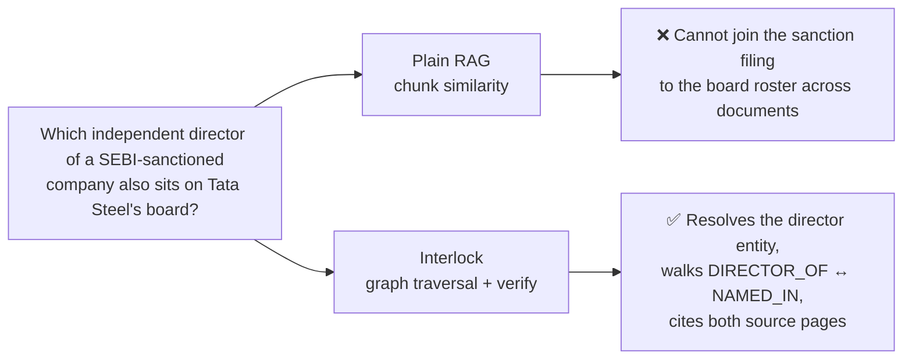

---

## ⚡ Powered by TigerGraph

Interlock leverages **TigerGraph** as its primary graph computation engine:
- **GSQL Schema & Graph Modelling:** Native graph schema modelling complex governance relationships with strict time attributes.
- **High-Performance GSQL Queries:** Parameterized, installed GSQL queries for multi-hop expansion, common director discovery, shortest path detection, and accumulator-based numerical aggregations.
- **Hybrid Vector + Graph Retrieval:** Graph topology combined with vector embeddings for comprehensive contextual grounding.
- **Python Integration:** Seamless communication using `pyTigerGraph`.

The installed, parameterized GSQL queries that back the graph pipelines:

| Query | Purpose |
| :--- | :--- |
| `entity_neighbors` | Bounded N-hop neighbourhood expansion around seed entities. |
| `shared_directors` | Directors common to two or more companies. |
| `path_between` | Shortest path (≤ 3 hops) between two entities. |
| `stake_aggregate` | Accumulator-based promoter pledge / stake totals. |
| `chunks_for_entities` | Text chunks that mention a given set of entities. |
| `get_edge_by_id` | Provenance lookup for a single fact edge (citation resolution). |

---

## 🚀 Key Architectural Principles

- **Strict Evidence Grounding:** Every extracted graph edge is immutably linked to its source document, page number, and verbatim quote. Records failing quote verification are quarantined.
- **Controlled Benchmark Comparison:** All three pipelines share the same underlying LLM (via Groq), retrieval services, and output schema (`AnswerResult`) to ensure objective evaluation.
- **Safe Agent Execution:** Read-only graph query permissions, deterministic AST-based math calculators, step/token safety caps, and claim-level verification against primary documents.
- **Deterministic & Reproducible:** Content-hashed LLM caching, frozen dev/test evaluation splits, run configurations, and one-command graph rebuilds.

---

## 🏗️ System Architecture

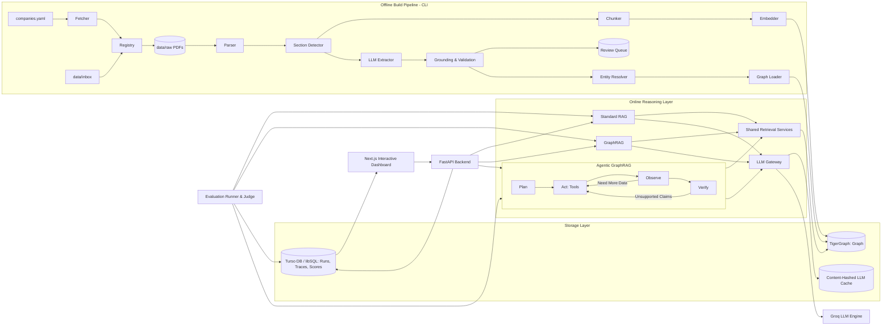

---

## 🔧 Offline Build Pipeline

`hl build-graph` runs eleven resumable steps in order. Any step can be re-entered with `hl build-graph --from <step>`, and `--reset-graph` wipes TigerGraph first.

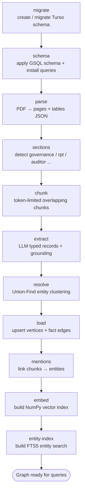

Per-document parsing extracts both the text layer (page-numbered) and table structure before section detection:

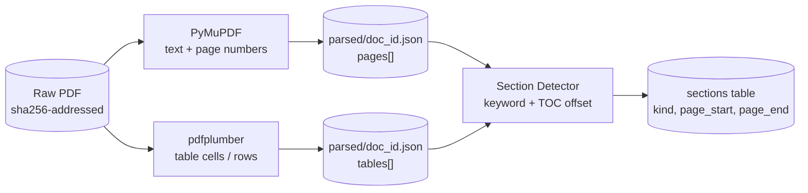

---

## 🗂 Knowledge Graph Schema

Vertices and the fact edges connecting them. Every fact edge carries the provenance invariant `doc_id + page + quote + run_id`.

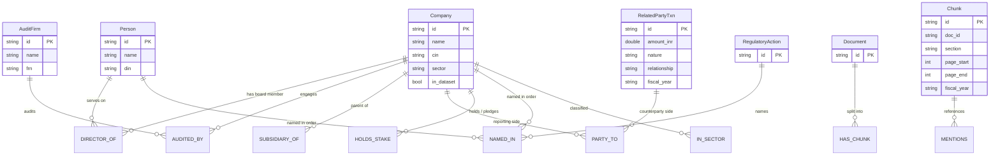

| Edge | From → To | Key attributes |
| :--- | :--- | :--- |
| `DIRECTOR_OF` | Person → Company | `role`, `independent`, `start_date`, `end_date`, `fiscal_year`, provenance |
| `AUDITED_BY` | Company → AuditFirm | `fiscal_year`, provenance (+ `AUDITS` reverse) |
| `SUBSIDIARY_OF` | Company → Company | `pct_held`, `as_of`, provenance (+ `HAS_SUBSIDIARY` reverse) |
| `PARTY_TO` | Company/Person → RelatedPartyTxn | `side` (reporting/counterparty), provenance (+ `HAS_PARTY` reverse) |
| `HOLDS_STAKE` | Company → Company | `pledged_pct` (+ `HELD_BY` reverse) |
| `NAMED_IN` | Company/Person → RegulatoryAction | (+ `NAMES` reverse) |
| `HAS_CHUNK` | Document → Chunk | (+ `CHUNK_OF` reverse) |
| `MENTIONS` | Chunk → Company/Person/AuditFirm | (+ `MENTIONED_IN` reverse) |

Every directed edge declares a `REVERSE_EDGE` so traversals can be walked from either endpoint.

---

## 🧪 Extraction & Grounding

Six typed Pydantic schemas are extracted from section text by the LLM, then every record must survive grounding and validation before it is accepted. Ungrounded or unit-ambiguous records are routed to the review queue rather than silently dropped.

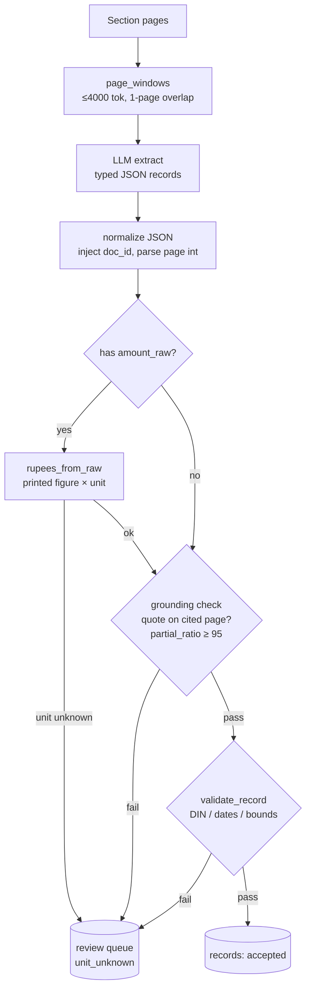

Shareholding tables take a deterministic rule-based parser first (dated at the fiscal year end); only tables the rule parser cannot read fall back to the LLM.

---

## 🔗 Entity Resolution

Mentions from every accepted record are clustered with Union-Find. Merges are decided by a strict priority ladder, and a cluster that ends up holding two different official IDs is split along those IDs and queued for review rather than merged.

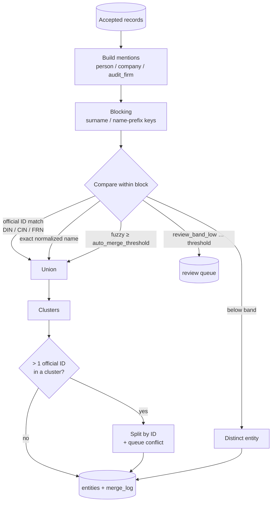

---

## 🧠 The Three Pipelines

All three return the identical `AnswerResult(pipeline, question, answer_short, answer_long, answer_type, citations, evidence, trace, usage, status)` contract, so they are directly comparable.

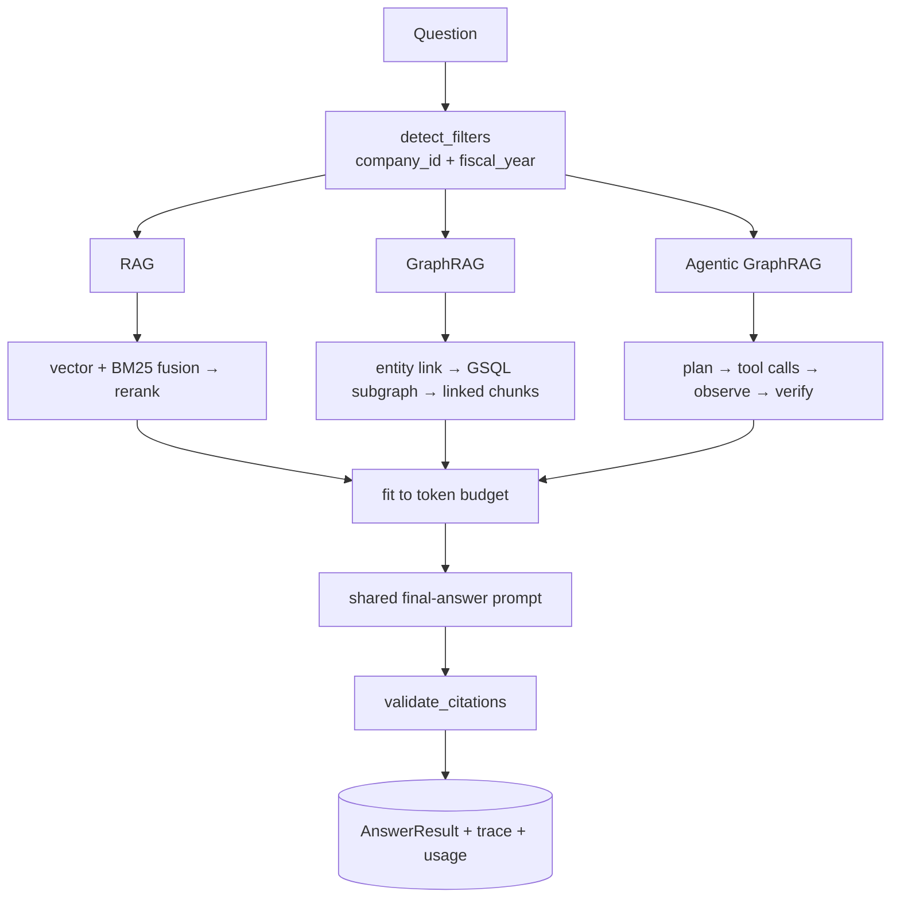

**Standard RAG — single-fact retrieval** (implemented):

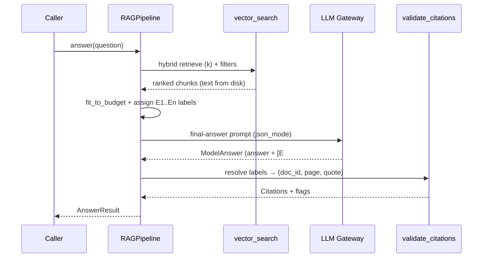

**GraphRAG — single bounded pass** (implemented): link entities, expand ≤2 hops with provenance, attach linked text, answer once; falls back to RAG's vector evidence when the graph has nothing (reason recorded in the trace).

**Agentic GraphRAG — bounded reasoning loop** (implemented: Plan → Act → Observe, then a shared final answer and a claim-level Verify):

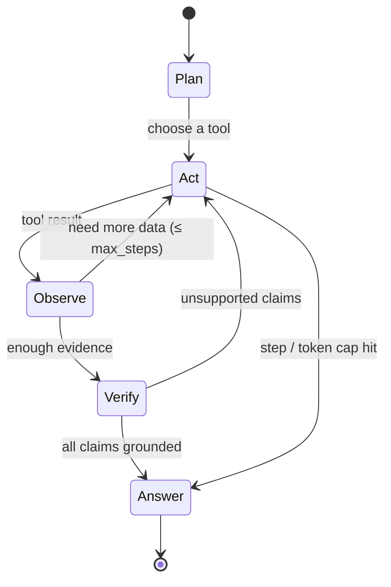

---

## 🔁 Request Lifecycle

Every online answer flows through the shared retrieval services, the LLM gateway (with cache + spend cap), and the tracer that records each step to the `traces` table for the dashboard's Question Inspector.

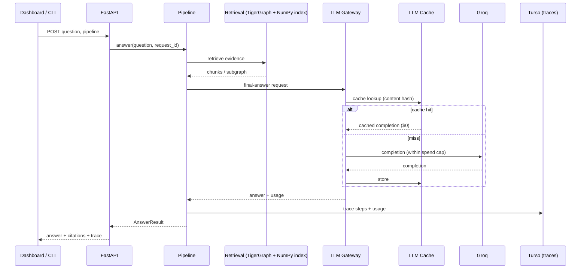

---

## 📊 Evaluation Harness

A frozen question set (`data/eval/questions_v1.jsonl`), per-type scorers, an optional LLM faithfulness judge, a failure taxonomy, and bootstrap confidence intervals let any pipeline be scored with one command: `hl eval --pipeline rag --split test --judge`.

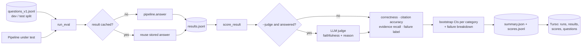

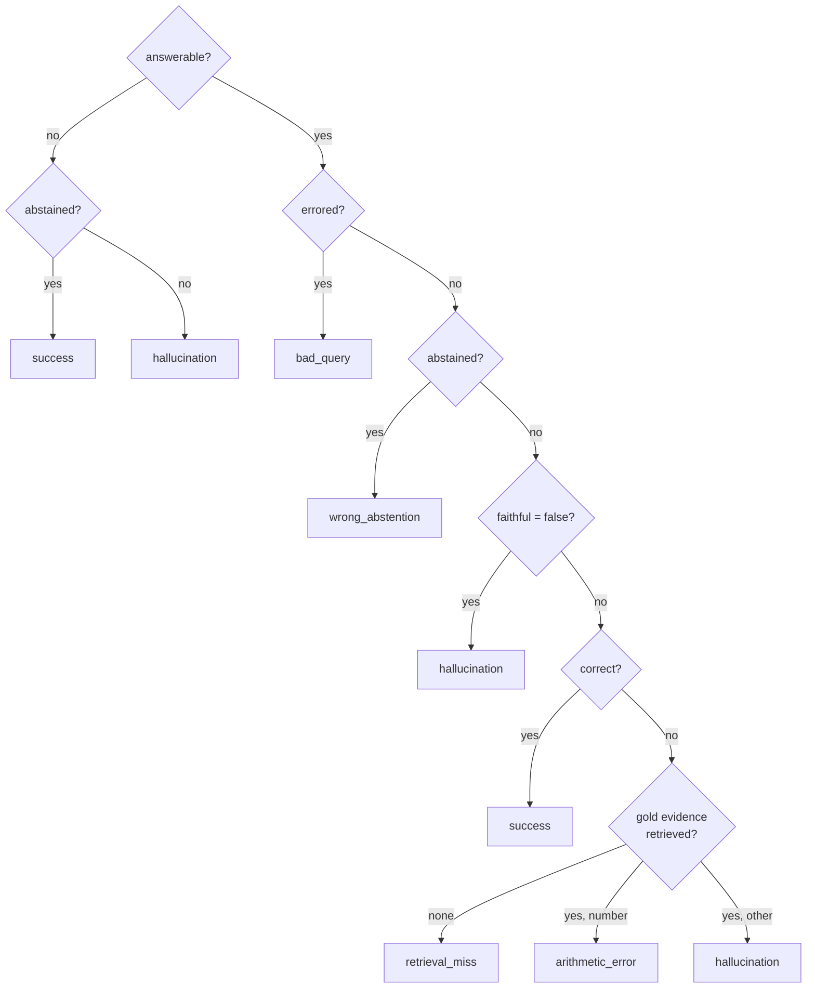

| Scorer | Answer type | Rule |
| :--- | :--- | :--- |
| `score_entity` | entity | normalized exact or fuzzy ≥ 92 (token-sort) |
| `score_list` | list | set F1 with fuzzy entity matching |
| `score_number` | number | within relative tolerance (default 1%) |
| `score_yes_no` | yes/no | first normalized token matches gold |
| `score_abstention` | unanswerable | abstained ⇔ not answerable |
| `citation_accuracy` | all | distinct cited `(doc_id, page)` ∈ gold evidence |
| `evidence_recall` | answerable | share of gold `(doc_id, page)` locations cited |
| `judge_faithfulness` | answered | every claim supported by the evidence shown (fails soft to unscored) |

---

## 💾 Storage Model

Three stores, each with a single clear responsibility.

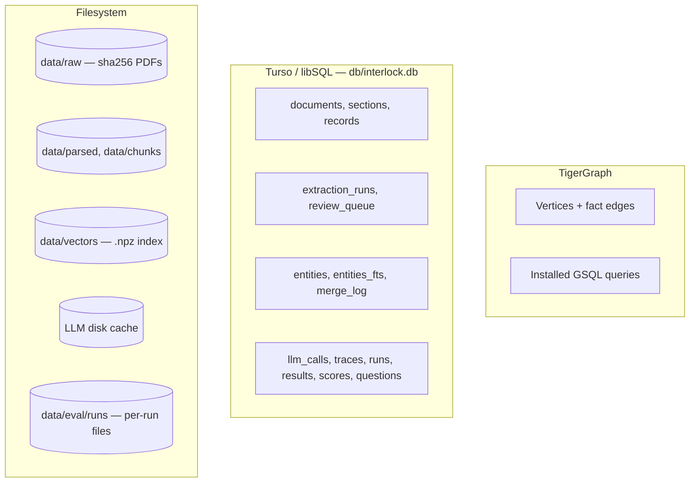

> **Vector search note:** native TigerGraph vector support was unavailable in the deployed version (ADR-0011), so vector search uses a local NumPy `.npz` index (`all-MiniLM-L6-v2`, 384 dims). Chunk text is read from `data/chunks/` on disk during retrieval.

---

## 🛠️ Tech Stack

| Domain | Technologies |
| :--- | :--- |
| **Graph & Database** | **TigerGraph** (GSQL, pyTigerGraph), **Turso / libSQL** (FTS5 search, run storage) |
| **Inference & LLMs** | **Groq API** (`openai/gpt-oss-120b` extraction & judge, `openai/gpt-oss-20b` answering), Custom Cache & Spend Cap Gateway |
| **Embeddings & Retrieval** | **sentence-transformers** (all-MiniLM-L6-v2, 384d), NumPy vector index, BM25 keyword fusion, cross-encoder reranker |
| **Backend & CLI** | **Python 3.11+**, `uv`, **FastAPI**, **Pydantic v2**, `httpx`, `pytest` |
| **Document Processing** | **PyMuPDF**, **pdfplumber**, **RapidFuzz**, Custom Layout Section Detectors |
| **Frontend Dashboard** | **Next.js 14** (App Router), **React**, **TypeScript**, **Tailwind CSS**, **Lucide Icons** |
| **DevOps & Infrastructure** | **Docker Compose**, GitHub Actions |

---

## 🏁 Getting Started

### 1. Prerequisites
- **Python 3.11+** with [uv](https://docs.astral.sh/uv/) installed.
- **Node.js 18+** and `npm`.
- A running **TigerGraph** instance (Local Docker or TigerGraph Cloud Savanna).
- A free **Groq API Key**.

---

### 2. Environment Configuration

Create a `.env` file in the project root:

```env
# ==========================================
# TigerGraph Credentials (Docker or Savanna)
# ==========================================
TG_HOST=http://localhost
TG_USERNAME=tigergraph
TG_PASSWORD=tigergraph
TG_SECRET=
TG_GRAPH=Interlock
TG_RESTPP_PORT=9000
TG_GS_PORT=14240

# ==========================================
# Database (Turso / libSQL)
# ==========================================
TURSO_DATABASE_URL=file:db/interlock.db
TURSO_AUTH_TOKEN=

# ==========================================
# LLM Provider API Key (Groq)
# ==========================================
GROQ_API_KEY=your_groq_api_key_here

# ==========================================
# Application Settings & Safety Caps
# ==========================================
DEMO_MODE=false
LLM_OFFLINE=false
LLM_SPEND_CAP_USD=25

# ==========================================
# Frontend Dashboard
# ==========================================
NEXT_PUBLIC_API_URL=http://localhost:8000
```

---

### 3. Running the Services

The application is structured into an **Offline Data & Ingestion Pipeline** and an **Online Interactive Dashboard**.

#### 🔹 Terminal 1: Python Ingestion & Processing Pipeline (CLI)
We utilize `uv` with our custom `hl` (Hackathon LLM) command suite:

```bash
# Sync dependencies and create the virtual environment
uv sync

# Run database migrations (Turso / libSQL)
uv run hl db-migrate

# Acquire filings & disclosures (Phase 1)
uv run hl fetch

# Register PDFs dropped into data/inbox/ (Phase 1)
uv run hl ingest-inbox

# Parse PDFs into structured text and tables (Phase 2)
uv run hl parse

# Detect and segment governance sections (Phase 2)
uv run hl detect-sections

# Break sections into token-limited overlapping chunks (Phase 2)
uv run hl chunk

# Extract typed JSON records using LLMs (Phase 2)
uv run hl extract --run-id "test-run-1"

# Interactive manual review queue CLI (Phase 2)
uv run hl review

# Measure and report extraction metrics (Phase 2)
uv run hl evaluate --run-id "test-run-1"

# Run the end-to-end ingestion and graph construction pipeline (Phase 3)
uv run hl build-graph
uv run hl build-graph --from load          # resume from a given step
uv run hl build-graph --reset-graph --yes  # wipe TigerGraph first

# Automatically generate the docs/data-quality.md report (Phase 3)
uv run hl quality

# Export/Import a sample graph to JSONL for one-command demos (Phase 3)
uv run hl export-sample
uv run hl import-sample

# Inspect acquired dataset coverage & filing inventory
uv run hl coverage

# Ask a question through a pipeline (Phase 4)
uv run hl ask "Who audited Tata Steel in FY2023-24?" --pipeline rag
uv run hl ask "Which directors sit on both Tata Steel and Tata Motors?" --pipeline graphrag
uv run hl ask "Who audited Tata Steel in FY2023-24?" --pipeline agent

# Score a pipeline against the frozen eval split (Phase 5)
uv run hl eval --pipeline rag --split test
uv run hl eval --pipeline rag --split test --judge   # also score faithfulness
uv run hl compare --a <run_id> --b <run_id>          # paired A-B per category (Phase 6)

# (Optional) Test LLM Gateway connectivity
uv run hl llm-ping "Hello, are you working?"
```

#### 🔹 Terminal 2: Interactive Next.js Frontend
Launch the modern visualization dashboard:

```bash
cd dashboard
npm install
npm run dev
```
Open [http://localhost:3000](http://localhost:3000) in your browser to explore the dashboard. It needs the API running in another terminal (`uv run hl serve`). With no `GROQ_API_KEY` the **Live ask** page answers the cached example questions instantly; anything else explains that it needs a key.

Dashboard checks: `npm test` (unit), `npm run typecheck`, `npm run build`, and the Playwright browser tests `npm run e2e` / `npm run e2e:graph` (see the header of each script in `dashboard/e2e/`).

---

## 📟 CLI Reference

Every command is exposed through the `hl` entry point (`uv run hl <command>`).

| Command | Phase | Description |
| :--- | :---: | :--- |
| `db-migrate` | 0 | Create / migrate the Turso (libSQL) schema. |
| `llm-ping` | 0 | Smoke-test the LLM gateway and Groq connectivity. |
| `fetch` | 1 | Discover documents per `companies.yaml` (logs `manual_needed`). |
| `ingest-inbox` | 1 | Register PDFs dropped into `data/inbox/`. |
| `coverage` | 1 | Generate `docs/coverage.md` filing inventory. |
| `parse` | 2 | PDF → page text + table JSON in `data/parsed/`. |
| `detect-sections` | 2 | Locate governance / RPT / auditor / shareholding sections. |
| `chunk` | 2 | Section text → token-limited overlapping chunks. |
| `extract` | 2 | LLM extraction of six typed record schemas. |
| `review` | 2 | Interactive CLI for the review queue. |
| `evaluate` | 2 | Report extraction quality and cost for a run. |
| `build-graph` | 3 | Full resumable rebuild (11 steps). |
| `quality` | 3 | Generate `docs/data-quality.md`. |
| `export-sample` / `import-sample` | 3 | Round-trip a sample graph as JSONL. |
| `ask` | 4 | Answer a question through a chosen pipeline. |
| `eval` | 5 | Score a pipeline (`rag`, `graphrag`, `agent`) against a frozen split with bootstrap CIs; `--judge` adds faithfulness. Persists to the DB. |
| `ask --pipeline agent` | 7 | Run the tool-using agent (budgeted loop, guarded graph access, claim verifier). |
| `serve` | 8 | Run the HTTP API for the dashboard (OpenAPI docs at `/docs`). |
| `demo-cache` | 8 | Build the no-key demo answers (`data/samples/cached_answers.jsonl`) from stored runs. |
| `compare` | 6 | Paired per-category comparison of two scored runs (A minus B) with a 95% bootstrap interval. |

---

## 📁 Repository Layout

```
Interlock-TG/
├── server/               # Python backend (all business logic)
│   ├── cli.py            # Entry point: `hl <command>`
│   ├── settings.py       # Typed Settings from .env + YAML
│   ├── common/           # Logging, IDs, timing, git state
│   ├── store/            # Turso/libSQL: connect(), migrate(), migrations/*.sql
│   ├── ingest/           # Data acquisition: fetcher, registry, inbox, coverage
│   ├── parse/            # PDF → pages/tables/sections/chunks
│   ├── extract/          # LLM extraction: schemas, runner, grounding, validate, rules/
│   ├── resolve/          # Entity resolution: normalize, match, mentions, cluster
│   ├── graph/            # TigerGraph: client, schema, loader, queries, gsql/
│   ├── embed/            # Vector index: provider, index, keyword, recall_test
│   ├── llm/              # LLM gateway: cache, pricing, providers (Groq)
│   ├── pipelines/        # Answer pipelines: rag.py, graphrag/, agent/, base, models, common/, config, prompts/
│   └── eval/             # Evaluation: models, scorers, normalize, stats, judge, taxonomy, persist, compare, runner
├── dashboard/            # Next.js 14 frontend (App Router, TypeScript, Tailwind)
├── config/               # companies.yaml, models.yaml, pipeline.yaml
├── data/                 # inbox/, raw/, parsed/, chunks/, vectors/, eval/
├── db/                   # Local libSQL database file
├── docs/                 # PRD, TRD, ARCHITECTURE, decisions/, coverage reports
├── tests/                # unit/ (no network/DB) and integration/ (marked)
└── spikes/               # One-off experiments (parser bake-off)
```

---

## 📚 Documentation Deep Dives

- 📑 **[PRD (Product Requirements Document)](docs/PRD.md):** User personas, functional requirements, and success metrics.
- 📐 **[TRD (Technical Requirements Document)](docs/TRD.md):** GSQL graph schemas, libSQL tables, and data models.
- 🏛️ **[Architecture Guide](docs/ARCHITECTURE.md):** In-depth pipeline flows, tool execution sandbox, and ADRs.
- 🤝 **[CLAUDE.md](CLAUDE.md):** Contributor guide — conventions, storage split, graph schema, and common pitfalls.

## Architecture

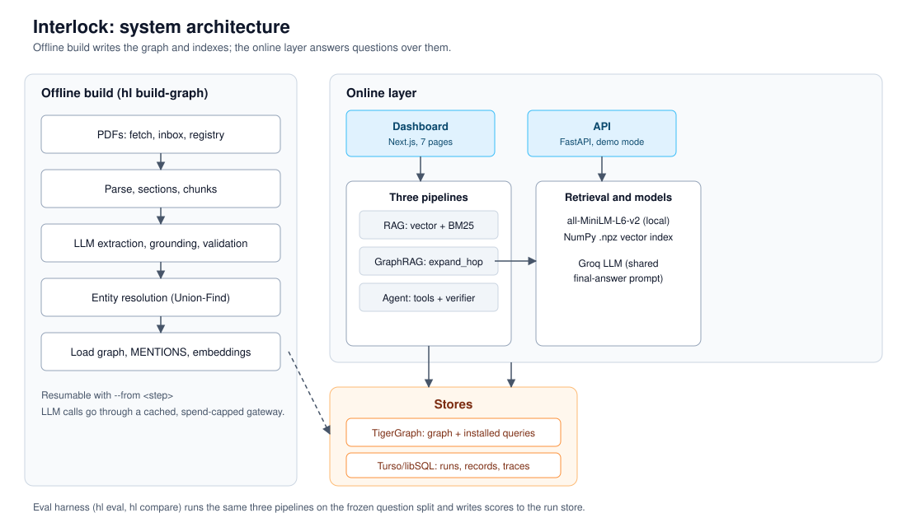

## Limitations

- **Small evaluation set.** 17 questions (12 test). `multi_hop`, `temporal` and `global` have no questions yet.
- **Graph pipelines unverified.** GraphRAG and the agent have not run against a live graph with loaded data.
- **Extraction is automatic.** Records pass a grounding check, but precision has been measured only on the pilot companies.
- **Coverage is partial.** TRF's filings are marked `manual_needed` for all three years.
- **Costs are not measured on a paid tier.** The free Groq tier was used, so cost figures are placeholders.
- **Single-node deployment.** The run store is a local libSQL file and the vector index is a local NumPy file.

## Disclaimer

Interlock is a research and demonstration project. It is **not investment, legal or regulatory
advice**. Its answers come from automatic extraction over public disclosures and can contain
errors or omissions. Check every fact against the cited source page before relying on it.

## Graph Edges across Fiscal Years
Each fiscal year's report produces its own `DIRECTOR_OF` edge (with a different `edge_id` discriminator). This intentional schema design natively records temporal context ('was a director according to the FY2022-23 report'). Graph queries should filter on `fiscal_year` or `start_date`/`end_date` to answer period-specific temporal questions.
