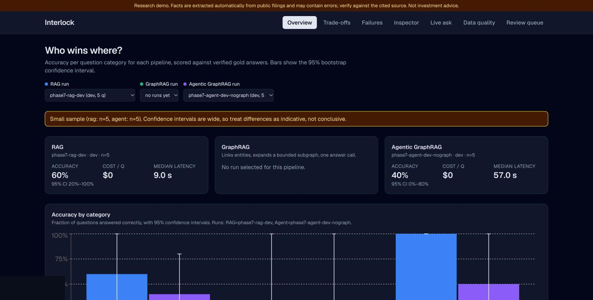
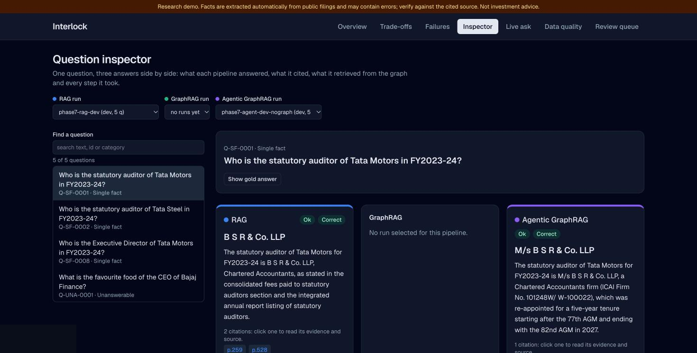
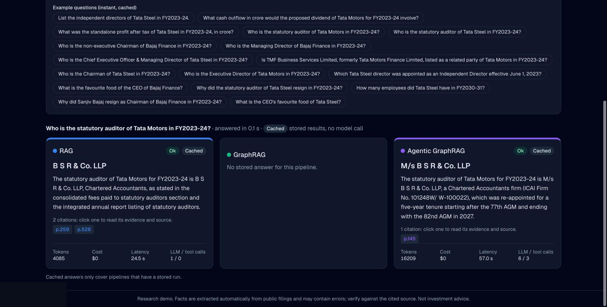
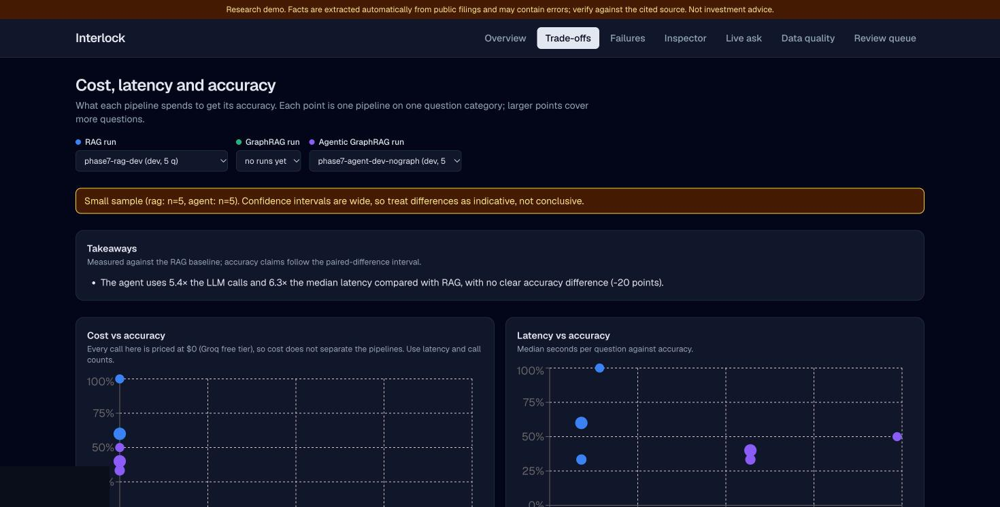
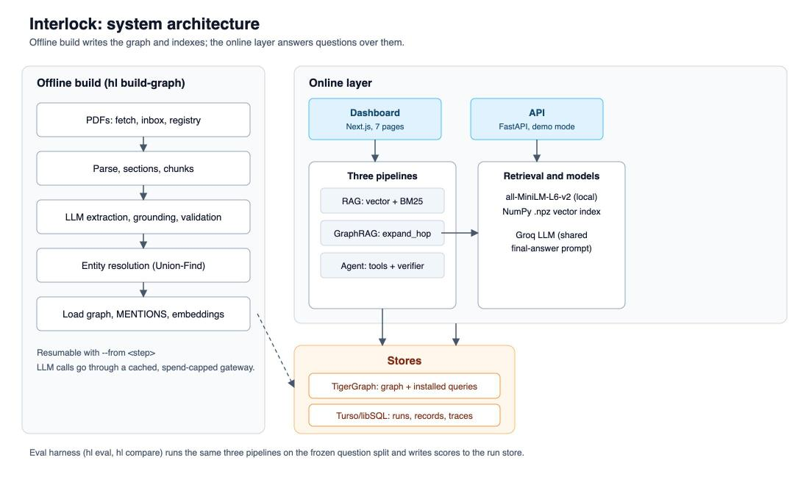
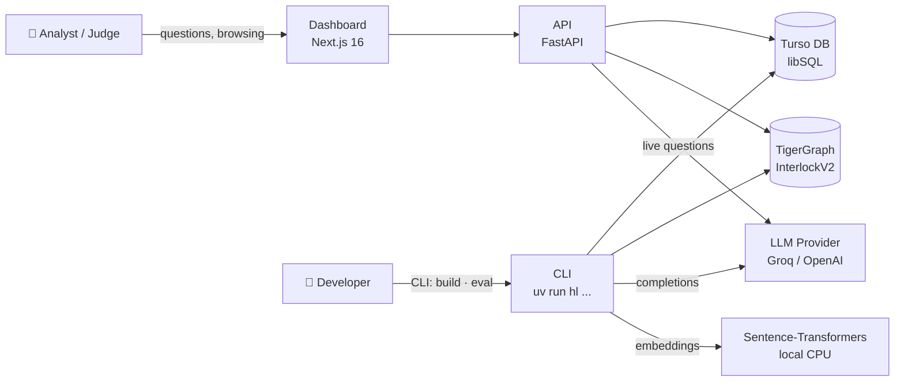
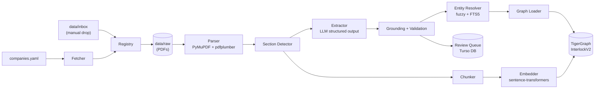
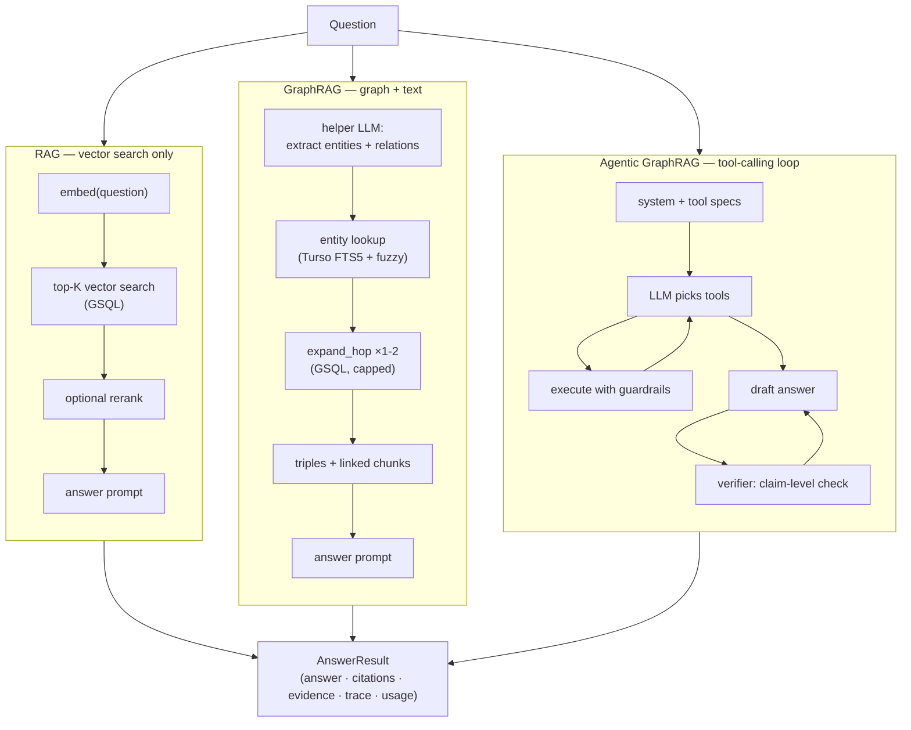
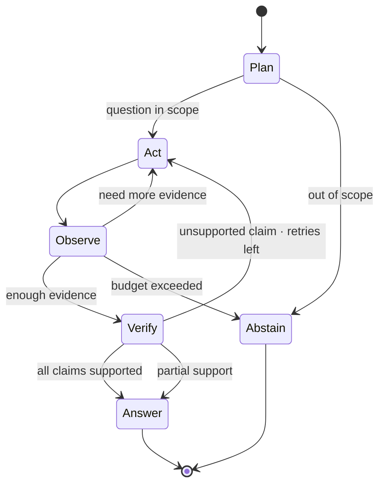
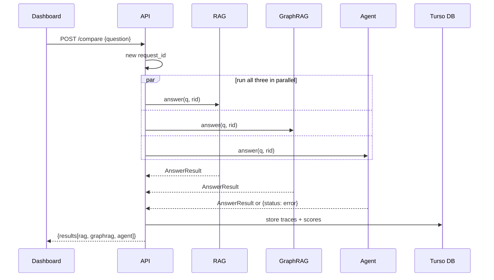

<div align="center">

# Interlock

### RAG · GraphRAG · Agentic GraphRAG — on Indian Corporate Governance Networks

[](https://github.com/Tetra4ge/Interlock-TG/actions/workflows/ci.yml)
[](https://python.org)
[](https://www.tigergraph.com/)
[](https://nextjs.org/)
[](https://fastapi.tiangolo.com/)
[](https://docker.com)

**Interlock** extracts board-interlocks, audit relationships, related-party transactions and promoter-pledge trails from Indian listed-company disclosures, loads them into a TigerGraph knowledge graph, and runs three question-answering pipelines — RAG, GraphRAG and Agentic GraphRAG — side by side on the same questions so you can see exactly where the graph changes the answer.

</div>

---

## Results

> **Honest caveat.** The test set has 17 questions across 3 of 6 planned categories (`single_fact`, `unanswerable`, `numerical`). No `multi_hop`, `temporal` or `global` questions exist yet. Treat these numbers as a working baseline, not a claim.

| Pipeline | Split | n | Accuracy (95% CI) | Median latency | LLM calls/q |
|---|---|---|---|---|---|
| **RAG** | test | 12 | **1.00** (1.00–1.00) | 32 s | 1.0 |
| **GraphRAG** | dev | 5 | **0.60** (0.20–1.00) | 29 s | 2.0 |
| **Agentic GraphRAG** | dev | 5 | 0.40 (0.00–0.80) | 57 s | 5.4 |

The RAG 1.00 interval is degenerate at n=12 — it says the system answers these 12 questions correctly, not that it will always. The GraphRAG dev run ran against a live TigerGraph graph for the first time; accuracy matched RAG on this small set, with the graph path confirmed end-to-end.

---

## Demo

> Demo mode serves cached answers instantly — no LLM key or graph connection required.

| Page | What it shows |
|---|---|
| **Overview** | Accuracy per category with 95% bootstrap CIs; pipeline leaders; paired differences |
| **Trade-offs** | Cost vs accuracy vs latency scatter; LLM / tool call breakdown |
| **Failures** | Stacked failure-type bar chart; filterable table with links to the inspector |
| **Inspector** | One question, three answers side by side; every citation linked to its source PDF page; interactive subgraph canvas |
| **Live ask** | Type any question; all three pipelines answer in parallel; demo questions reply in < 0.1 s |
| **Data quality** | Extraction precision, entity resolution, provenance completeness |
| **Review queue** | Quarantined records pending human review |

**Screenshots from a live local run:**

<table>
  <tr>
    <td></td>
    <td></td>
  </tr>
  <tr>
    <td></td>
    <td></td>
  </tr>
</table>

---

<div align="center">

</div>

## Quick Start

### Demo mode — no API key, no TigerGraph needed

```bash
git clone https://github.com/Tetra4ge/Interlock-TG.git
cd Interlock-TG
docker compose up --build
```

- Dashboard → [http://localhost:3000](http://localhost:3000)
- API docs → [http://localhost:8000/docs](http://localhost:8000/docs)

Both ports are bound to `127.0.0.1`. The first build downloads Python + Next.js dependencies (~2 GB including a CPU-only torch wheel for sentence-transformers); subsequent builds use Docker's layer cache.

### Live questions — with a Groq API key

```bash
cp .env.example .env
# Edit .env: set GROQ_API_KEY=gsk_...
DEMO_MODE=false docker compose up --build
```

### With a local TigerGraph instance

```bash
# Starts TigerGraph in a Docker container (heavy; ~10 min on first start)
docker compose --profile tigergraph up --build
```

---

## Architecture

### System overview



### Offline build pipeline

Turns public PDFs from BSE/NSE filings into a structured knowledge graph.



**What gets extracted:** board directors, audit firms, related-party transactions, subsidiary relationships, promoter-pledge data — each with the source document, page, and exact quote so every graph edge is traceable back to a filing.

### Three answering pipelines

All three pipelines share the same question, the same evidence budget, the same answer prompt, and the same verifier. The only difference is *how they retrieve evidence*.



### Agent control loop



**Agent tools available:**
- `search_text` — vector search over chunks
- `find_entity` — fuzzy entity lookup by name
- `neighbors` — expand one hop from an entity  
- `expand_hop` — multi-hop GSQL traversal
- `get_evidence` — fetch full text of a cited chunk
- `graph_query` — run an allow-listed GSQL query
- `calculate` — safe arithmetic (AST whitelist: no `eval`)

### API & Dashboard



---

## Data

### Corpus

| Field | Value |
|---|---|
| Source | BSE/NSE annual reports and corporate governance disclosures |
| Companies | 5 (TATASTEEL, TATAMOTORS, BAJFINANCE, BAJAJFINSV, + 1) |
| Documents | 26 |
| Chunks | 18,994 |
| Fiscal years | FY2021-22 → FY2023-24 |

### Knowledge graph (live, `InterlockV2`)

| Vertex type | Count |
|---|---|
| Company | 5 |
| Person | 27 |
| AuditFirm | 4 |
| Document | 26 |
| Chunk | 18,994 |

| Edge type | Count | Meaning |
|---|---|---|
| DIRECTOR_OF | 28 | Person → Company (with fiscal year, role) |
| AUDITED_BY | 8 | Company → AuditFirm (with fiscal year) |
| SUBSIDIARY_OF | 1 | Company → Company |
| MENTIONS | 3,240 | Chunk → Entity (entity appears in that chunk) |
| HAS_CHUNK | 18,994 | Document → Chunk |

### Data quality

- Extraction precision is measured by grounding: every extracted fact must have a matching quote in the source page. Facts without a verifiable quote go to the review queue.
- Entity resolution uses fuzzy matching (RapidFuzz token_set_ratio ≥ 85) + TF-IDF FTS5 search, with ambiguous matches flagged for review.
- Provenance completeness (graph edges traceable to a specific PDF page): **28.2%** of accepted records — honest, not assumed.

### Rebuilding from source

```bash
# Needs: GROQ_API_KEY in .env, ~$2-5 in LLM spend, several hours
uv run hl fetch           # download filings
uv run hl ingest-inbox    # register + parse
uv run hl extract         # LLM extraction (cached)
uv run hl build-graph     # resolve + load into TigerGraph + embed
```

---

## Evaluation

### Method

Questions are categorised as `single_fact`, `multi_hop`, `temporal`, `numerical`, `unanswerable` or `global`. Gold answers are verified by a second reader against the source filing. Scoring:

- **Accuracy** — exact-match after normalisation (company name aliases, "M/s" prefix, etc.)
- **Citation accuracy** — fraction of citations where the cited page contains the quoted text
- **Evidence recall** — fraction of gold evidence pages cited
- **Faithfulness** — LLM judge (120B model) checks every factual claim against the evidence provided to the pipeline, not against its training data

Pipelines are compared with bootstrap paired-difference CIs (10,000 samples). A lead is "clear" only when the CI for the difference excludes zero.

### Running an eval

```bash
# Run one pipeline on the test split
uv run hl eval --pipeline rag --split test --run-id my-rag-run

# Score an existing run with the faithfulness judge
uv run hl evaluate --run-id my-rag-run

# Compare two runs
uv run hl compare --a my-rag-run --b my-graphrag-run
```

---

## Development

### Prerequisites

- Python 3.11+ with [uv](https://docs.astral.sh/uv/)
- Node.js 22+ with npm
- Docker (for the container stack)

### Setup

```bash
git clone https://github.com/Tetra4ge/Interlock-TG.git
cd Interlock-TG
cp .env.example .env          # fill in credentials

# Backend
uv sync

# Dashboard
cd dashboard && npm ci
```

### Running tests

```bash
# Backend — 791 unit tests, no credentials needed
uv run pytest -q

# Integration tests (need a live TigerGraph + LLM key)
uv run pytest -m integration -q

# Dashboard
cd dashboard && npm test

# End-to-end (Playwright)
cd dashboard && node e2e/smoke.mjs
```

### Repository layout

```
server/
├── api/          FastAPI routes, schemas, deps
├── pipelines/    rag/, graphrag/, agent/ — all implement Pipeline protocol
├── graph/        TigerGraph client, GSQL queries, schema
├── store/        Turso DB access, entity search
├── eval/         Scorer, judge, reporter
├── llm/          Gateway, cache, models
└── cli.py        Entry-point: hl <command>
dashboard/
├── src/app/      Next.js App Router pages
├── src/lib/      Pure TS helpers (format, chart, graph layout)
└── src/components/
data/
├── eval/         Questions + run artefacts
└── samples/      Demo cache + sample graph export
docs/             Architecture, PRD, TRD, decisions, results
scripts/          Docker entrypoint, graph seeding
tests/            unit/, integration/, e2e/
```

---

## Limitations

- **Small question set.** 17 questions, 3 of 6 categories. The multi-hop, temporal and global categories — where GraphRAG and the Agent are designed to win — have no questions yet.
- **No test-split runs for GraphRAG or the Agent.** The GraphRAG dev run ran end-to-end against the live graph; no head-to-head comparison on the same held-out test set exists.
- **Free-tier LLM.** Groq's daily limit (200k tokens/day on the free tier) was exhausted during evaluation. Latency and cost numbers are indicative, not measured on a paid tier.
- **Data coverage gaps.** `AUDITED_BY` edges exist only for BAJFINANCE and BAJAJFINSV. Tata Steel and Tata Motors auditor questions are answered by vector search over raw chunk text, not the graph.
- **Automatic extraction errors.** LLM extraction at scale produces hallucinations. The grounding step rejects facts without a source quote; the review queue holds borderline cases. Do not treat the graph as ground truth without reviewing the provenance.

---

## Disclaimer

> This is a research prototype. Answers are generated automatically from public filings and may contain errors. Nothing here constitutes investment, legal or financial advice. All data is sourced from public regulatory disclosures.

---

## Built by Hotty\_Fi5e

<table align="center">
  <tr>
    <td align="center" width="20%">
      <a href="https://github.com/Rahul-8283"></a><br>
      <b>Rahul L S</b><br>
      <a href="https://github.com/Rahul-8283">@Rahul-8283</a>
    </td>
    <td align="center" width="20%">
      <a href="https://github.com/prajwal-priyadarshan"></a><br>
      <b>G Prajwal Priyadarshan</b><br>
      <a href="https://github.com/prajwal-priyadarshan">@prajwal-priyadarshan</a>
    </td>
    <td align="center" width="20%">
      <a href="https://github.com/KKabilan07"></a><br>
      <b>Kabilan K</b><br>
      <a href="https://github.com/KKabilan07">@KKabilan07</a>
    </td>
    <td align="center" width="20%">
      <a href="https://github.com/KishoreB25"></a><br>
      <b>Kishore B</b><br>
      <a href="https://github.com/KishoreB25">@KishoreB25</a>
    </td>
    <td align="center" width="20%">
      <a href="https://github.com/kesavvvvvv"></a><br>
      <b>Kesav</b><br>
      <a href="https://github.com/kesavvvvvv">@kesavvvvvv</a>
    </td>
  </tr>
</table>

---

<div align="center">
  <sub>Built with TigerGraph · FastAPI · Next.js · sentence-transformers · Groq</sub>
</div>
