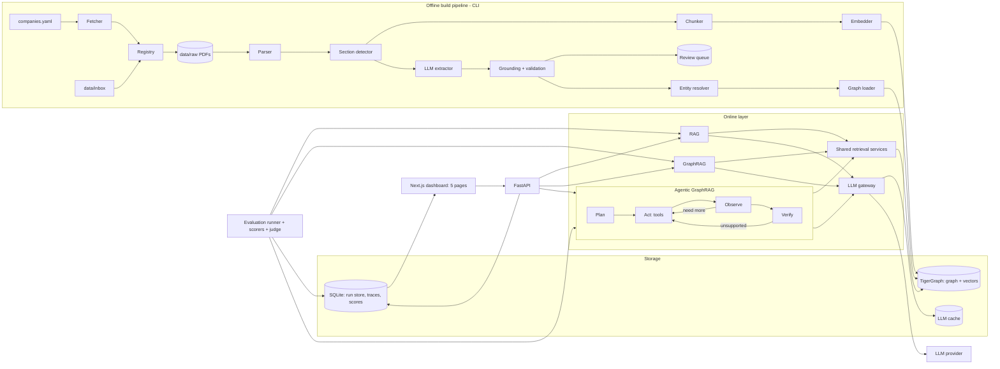

# Interlock — Agentic GraphRAG for Corporate Governance Networks

Interlock answers natural-language questions about Indian listed companies using public disclosures (annual reports, shareholding patterns, related-party disclosures, regulatory orders). It builds a typed, time-aware knowledge graph of companies, directors, shareholders, auditors, related-party transactions and regulatory actions, then answers each question **three ways** and measures where each approach succeeds or fails:

| Pipeline | How it answers |
| --- | --- |
| **RAG** | Vector search over text chunks, one LLM call |
| **GraphRAG** | Entity linking, bounded subgraph retrieval plus linked text, one LLM call |
| **Agentic GraphRAG** | An agent that plans, calls graph/text/calculation tools step by step, and verifies its answer before responding |

All three use the same LLM, corpus, answer rules and output format (`AnswerResult`), so differences come from the method, not the setup.

> **Status:** documentation complete, implementation not started. Start at [Phase 0](docs/phases/phase-00-setup-and-spikes.md).

## Why

Governance risk often lives in relationships *between* disclosures: a director on several boards, one of which was named in a regulatory order; a pledged promoter stake spread across subsidiaries; related-party transactions with entities that share directors; an auditor change shortly after a regulatory action. Plain RAG cannot reliably join facts across documents or total values over many rows. This project quantifies that gap.

Example questions, by category: single-fact, multi-hop, temporal, numerical, global, and unanswerable (the system must say "not found in the data").

## Built on TigerGraph

This project is built for a hackathon organised by TigerGraph, so TigerGraph is the graph engine: the schema is defined in GSQL, facts are upserted through `pyTigerGraph`, and GraphRAG and the agent traverse the graph with installed, parameterized GSQL queries (multi-hop expansion, shared-director search, path finding, accumulator-based totals). Chunk embeddings live in a TigerGraph vector attribute when the deployed version supports it (fallback: local vector index). GSQL syntax and version-specific features are marked **Verify** in the docs.

## Key design points

- **Grounded facts:** every graph edge carries document, page and exact quote; records whose quote is not on the stated page are rejected.
- **Fair comparison:** shared retrieval services, prompts, evidence budget and answer model.
- **Verified evaluation:** 150–300 questions across 6 categories, gold answers checked against source PDFs, frozen dev/test split, bootstrap confidence intervals, failure taxonomy.
- **Safe agent:** read-only graph access, step/token/time budgets, claim-level verifier, AST calculator, retrieved text treated as untrusted.
- **Reproducible:** content-hash LLM cache, run config and git commit stored per run, one-command graph rebuild and evaluation.

## Planned stack

Python 3.11+ (uv, Pydantic v2, httpx) · PyMuPDF + pdfplumber · **TigerGraph** (graph, GSQL installed queries, vector search; `pyTigerGraph` client) · SQLite FTS5 for entity-name lookup · SQLite run store · custom LLM gateway with cache and cost cap · hand-written agent state machine · FastAPI · Next.js dashboard (TypeScript, React, Tailwind CSS) · pytest, Ruff, mypy · Docker Compose.

## Architecture

A modular monolith with two halves joined by shared storage:

- **Offline build pipeline (CLI):** fetch → registry → parse → sections → chunk / extract → ground + validate → entity resolution → graph load + embeddings.
- **Online layer:** three pipelines, evaluation runner, API and a five-page dashboard (Overview, Trade-offs, Failures, Question inspector, Live ask).

### System diagram

**Reading the diagram:** the offline pipeline turns PDFs into a grounded graph and vector index; the three pipelines share one retrieval layer and one LLM gateway, so they differ only in *how* they use retrieval; the evaluation runner scores all three into SQLite, which feeds the dashboard. Detailed sequences (RAG, GraphRAG, agent loop, `/compare`, evaluation flow) are in [docs/ARCHITECTURE.md](docs/ARCHITECTURE.md).

## Deliverables

GitHub repo · architecture diagram · demo video · metrics dashboard.

## Documentation

Full index in [docs/README.md](docs/README.md).

| Document | Contents |
| --- | --- |
| [PRD](docs/PRD.md) | Problem, users, goals, requirements (FR/NFR), success metrics, scope, risks, open questions |
| [TRD](docs/TRD.md) | Stack decisions, repo layout, config, data models, SQLite and TigerGraph (GSQL) schemas, interfaces, API, security, testing |
| [ARCHITECTURE](docs/ARCHITECTURE.md) | Context, containers, build pipeline, online layer, agent loop, deployment, ADRs |
| [Phases 0–10](docs/phases/) | Ordered build plan, each with steps, tests, exit criteria and hand-off |

## Build plan

| Release | Phases |
| --- | --- |
| R0 Foundations | 0 Setup, TigerGraph + GSQL spike, LLM gateway, parser spike |
| R1 Data | 1 Acquisition · 2 Extraction pilot · 3 Entity resolution + TigerGraph build (GSQL schema, loading, installed queries, vectors) |
| R2 Baseline + Eval | 4 RAG baseline · 5 Evaluation set + runner |
| R3 Comparison | 6 GraphRAG (GSQL traversal) · 7 Agentic GraphRAG (allow-listed GSQL query tools) |
| R4 Presentation | 8 API + dashboard · 9 Hardening |
| R5 Submission | 10 Demo + submission |

If time runs short, cut in this order: hosted deployment, global mode, FastAPI, OCR, company count (keep ≥ 30). Never cut: grounding check, verified test set, fair comparison, failure analysis.

## Getting started

1. Read the [PRD](docs/PRD.md) and settle the open questions in PRD §10 (dataset/domain, LLM budget, download permissions, hosting).
2. Follow [Phase 0](docs/phases/phase-00-setup-and-spikes.md), then each phase in order; each has exit criteria to check before moving on.

## Disclaimer

For research and demonstration only. Not investment advice. Facts are extracted automatically from public filings and may contain errors; verify against the cited source. The system reports cited facts and does not label any company or person as risky or fraudulent.
