<div align="center">

# Interlock

### RAG · GraphRAG · Agentic GraphRAG — on Indian Corporate Governance Networks

[](https://github.com/Tetra4ge/Interlock-TG/actions/workflows/ci.yml)
[](https://python.org)
[](https://www.tigergraph.com/)
[](https://nextjs.org/)
[](https://fastapi.tiangolo.com/)
[](https://docker.com)

</div>

---

## The Problem

> **When the answer lives across documents, vector search is not enough.**

Governance risk in Indian listed companies rarely sits isolated inside a single annual report. It emerges from *connections* — relationships that span multiple documents, companies and fiscal years.

Plain vector RAG returns the most similar text chunks and asks the LLM to reason. It cannot join two facts from different PDFs, aggregate across companies, or follow a chain of edges. These are exactly the shapes that matter in corporate governance:

| Risk pattern | Why RAG fails | What you actually need |
|---|---|---|
| **Board interlocks** | A director sitting on five boards simultaneously is invisible inside any single filing | Traverse DIRECTOR_OF edges across companies |
| **Related-party trails** | Transactions routed through subsidiary chains obscure beneficial ownership | Multi-hop traversal through PARTY_TO and SUBSIDIARY_OF |
| **Auditor independence** | An audit firm serving the same promoter group for 15 years only appears as a risk when you join AUDITED_BY records across companies and fiscal years | Join graph edges across time and entities |
| **Promoter pledge cascades** | A pledge in one entity funding acquisition in another creates a risk chain | Follow pledges hop by hop |
| **Temporal changes** | A director who resigned the quarter before a regulatory action is not suspicious in any one document | Join events across time with the same entity ID |

**Interlock** is a system that builds a TigerGraph knowledge graph from NSE/BSE annual report PDFs and runs three question-answering pipelines — RAG, GraphRAG and Agentic GraphRAG — side by side on the same questions to prove, with measured accuracy and confidence intervals, exactly where the graph changes the answer.

---

## Results

> **Honest caveat.** 17 questions, 3 of 6 planned categories (`single_fact`, `unanswerable`, `numerical`). No `multi_hop`, `temporal` or `global` questions exist yet. Treat these as a working baseline.

| Pipeline | Split | n | Accuracy (95% CI) | Median latency | LLM calls/q |
|---|---|---|---|---|---|
| **RAG** | test | 12 | **1.00** (1.00–1.00) | 32 s | 1.0 |
| **GraphRAG** | dev | 5 | **0.60** (0.20–1.00) | 29 s | 2.0 |
| **Agentic GraphRAG** | dev | 5 | 0.40 (0.00–0.80) | 57 s | 5.4 |

The RAG 1.00 interval is degenerate at n=12 — it says the system answers these 12 questions correctly, not that it always will. GraphRAG ran end-to-end against the live TigerGraph graph for the first time; the graph path is confirmed working. The Agent baseline ran without a graph (Groq daily limit hit) — its real number against a live graph is expected higher.

---

## Quick Start

### Demo mode — no API key, no TigerGraph needed

```bash
git clone https://github.com/Tetra4ge/Interlock-TG.git
cd Interlock-TG
docker compose up --build
```

- Dashboard → [http://localhost:3000](http://localhost:3000)
- API docs → [http://localhost:8000/docs](http://localhost:8000/docs)

Both ports are bound to `127.0.0.1`. First build downloads Python + Next.js deps (~2 GB); subsequent builds use Docker's layer cache.

### With a live LLM (Groq free tier)

```bash
cp .env.example .env
# Set GROQ_API_KEY=gsk_...
DEMO_MODE=false docker compose up --build
```

### With a local TigerGraph instance

```bash
docker compose --profile tigergraph up --build
```

---

## How It Works — End to End

### Step 1 · Offline build pipeline

Turns public PDFs from BSE/NSE filings into a structured knowledge graph.


What each step does:

- **Fetcher** — rate-limited HTTP downloader with backoff; PDFs stored content-addressed (`sha256.pdf`), no re-downloads
- **Parser** — PyMuPDF for text (page numbers preserved), pdfplumber for table structure (row/column alignment)
- **Section detector** — keyword-based locator finds governance reports, RPT notes, auditor reports, shareholding tables across varied Indian filing formats
- **Extractor** — LLM extracts 6 typed schemas (Director, Auditor, RelatedPartyTxn, Subsidiary, Shareholding, RegulatoryAction), each with a verbatim `Evidence(doc_id, page, quote)`
- **Grounding** — every extracted quote is verified against its stated PDF page (RapidFuzz partial_ratio ≥ 95); facts that fail go to the review queue, never silently dropped
- **Entity resolver** — Union-Find clustering: official ID (DIN/CIN/FRN) → exact name → fuzzy ≥ 95 → review band (85–95) → new entity. Never merges two mentions with different official IDs
- **Graph loader** — writes `IL_`-prefixed vertices and edges into TigerGraph `InterlockV2`; every fact edge carries `doc_id + page + quote + run_id`
- **Embedder** — `all-MiniLM-L6-v2` (local, CPU, no API cost) embeds all 18,994 chunks into a NumPy `.npz` vector index

### Step 2 · Online answer layer

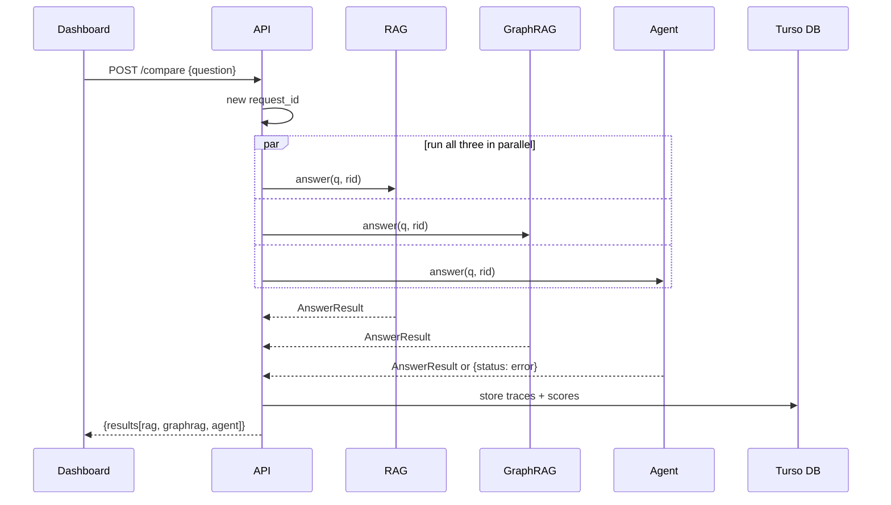

All three pipelines return the same `AnswerResult` contract: `pipeline · question · answer_short · answer_long · answer_type · citations · evidence · trace · usage · status`.

### Step 3 · Evaluation

- Gold answers verified against source PDF pages by a second reader
- Exact-match normalisation for company name aliases ("Bajaj Finance" ≡ "Bajaj Finance Limited")
- Bootstrap 95% CIs — 10,000 resamples per category
- Faithfulness judge (120B model) checks each claim against the evidence the pipeline was shown, not against training data
- Failure taxonomy: `retrieval_miss`, `entity_link_error`, `hallucination`, `wrong_abstention`, `bad_query`, `arithmetic_error`, `temporal_error`
- Paired-difference test: a lead is "clear" only when the CI for the difference excludes zero

---

## The Three Pipelines

All three use the same LLM (Groq), the same corpus, the same evidence budget and the same answer prompt. The only difference is *how they retrieve evidence*.

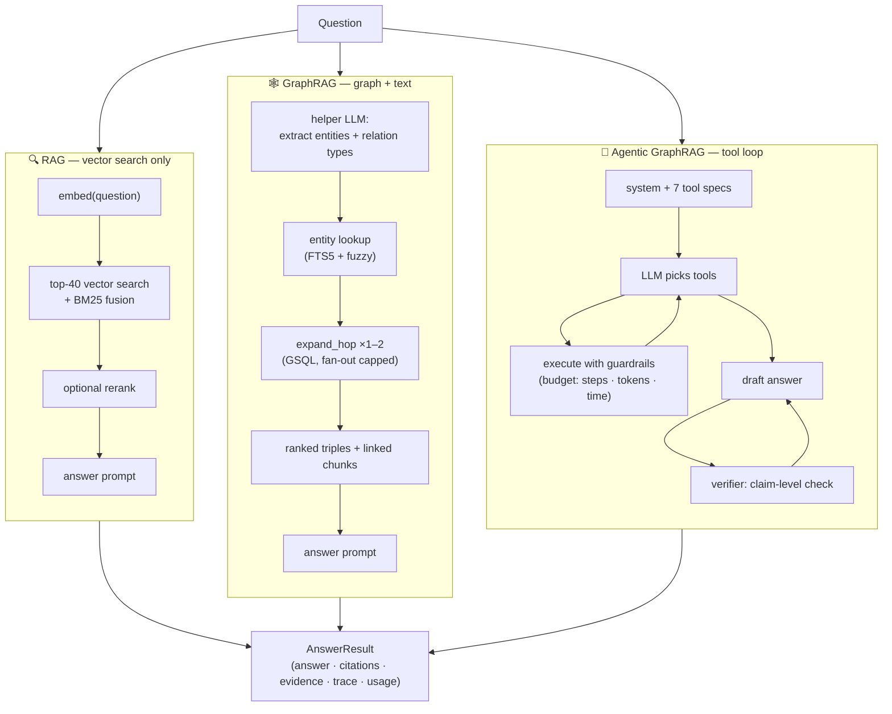

### RAG

Embeds the question, searches the vector index for top-40 chunks, fuses with BM25 keyword scores via reciprocal rank fusion, optional cross-encoder rerank, fits a 4,000-token evidence budget, one LLM answer call.

**Best for:** single-fact lookups where the answer lives in one passage. **Cost:** 1 LLM call/question.

### GraphRAG

A helper LLM call extracts entity mentions and relation types from the question. Those entities are linked to graph nodes via FTS5 + fuzzy search, then expanded up to 2 hops with an installed GSQL query (`expand_hop`). The resulting triples are serialised with provenance and combined with linked text chunks for the answer call. Falls back to RAG's vector path if no entities link.

**Best for:** 1–2 hop structural questions — shared directors, auditor tenure, subsidiary ownership. **Cost:** 2 LLM calls/question.

### Agentic GraphRAG

A tool-calling loop runs under hard budgets (8 steps, 40k tokens, 120 s). The model picks from 7 tools:

| Tool | Does |
|---|---|
| `search_text` | Vector search over chunks |
| `find_entity` | Fuzzy entity lookup by name |
| `neighbors` | Expand one hop from an entity |
| `expand_hop` | Multi-hop GSQL traversal |
| `get_evidence` | Fetch full text of a cited chunk |
| `graph_query` | Run an allow-listed GSQL query |
| `calculate` | Safe arithmetic (AST whitelist, no `eval`) |

After the loop, a separate verifier checks each claim against the evidence — and buys one more agent cycle if a claim is unsupported. The model never writes GSQL; `graph_query` is an allow-list of 4 installed queries with typed, regex-validated parameters.

**Best for:** multi-hop trails, aggregations, temporal cascades, auditor chains. **Cost:** 3–8 LLM calls/question.

### Agent control loop

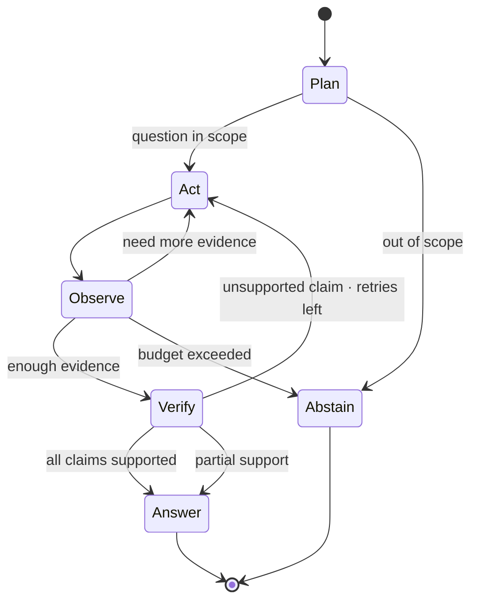

---

## Knowledge Graph

### Schema (`InterlockV2` on TigerGraph)

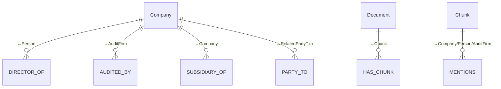

| Vertex | Count | Key attributes |
|---|---|---|
| Company | 5 | `company_id`, `name`, `sector` |
| Person | 27 | `person_id`, `name`, `din` |
| AuditFirm | 4 | `firm_id`, `name`, `frn` |
| Document | 26 | `doc_id` (SHA256), `company_id`, `fiscal_year`, `doc_type` |
| Chunk | 18,994 | `chunk_id`, `text`, `page_start`, `page_end`, `section`, embedding |

| Edge | Count | Meaning |
|---|---|---|
| DIRECTOR_OF | 28 | Person → Company · `role`, `independent`, `fiscal_year`, `doc_id`, `page`, `quote` |
| AUDITED_BY | 8 | Company → AuditFirm · `fiscal_year`, `doc_id`, `page`, `quote` |
| SUBSIDIARY_OF | 1 | Company → Company · `pct_held` |
| MENTIONS | 3,240 | Chunk → Entity · entity appears in that chunk |
| HAS_CHUNK | 18,994 | Document → Chunk |

Every fact edge carries `doc_id + page + quote + run_id` — full provenance, traceable back to a specific PDF page.

### Live verification

`shared_directors(["C:TATAMOTORS", "C:TATASTEEL"])` correctly finds **N. Chandrasekaran** as a common director — confirmed against the live graph. A full GraphRAG pipeline run on _"Which director sits on the boards of both Tata Motors and Tata Steel?"_ completed end-to-end: `link_plan → link_entities → expand_hop(×2) → linked_text → final_answer`, answering correctly with graph triples as citations, not vector-search fallback.

---

## Dashboard

> Demo mode serves cached answers instantly — no API key or graph connection required.

| Page | What it shows |
|---|---|
| **Home** | Problem statement, pipeline comparison, graph stats, architecture |
| **Overview** | Accuracy per category with 95% bootstrap CIs; pipeline leaders; paired differences |
| **Trade-offs** | Cost vs accuracy vs latency scatter; LLM / tool call breakdown |
| **Failures** | Stacked failure-type bar chart; filterable table linked to the inspector |
| **Inspector** | One question, three answers side by side; every citation linked to its source PDF page; interactive subgraph canvas; step-by-step traces |
| **Live ask** | Type any question; all three pipelines answer in parallel; demo questions reply in < 0.1 s |
| **Data quality** | Extraction precision, entity resolution, provenance completeness |
| **Review queue** | Quarantined records pending human review |

---

## Architecture

<div align="center">
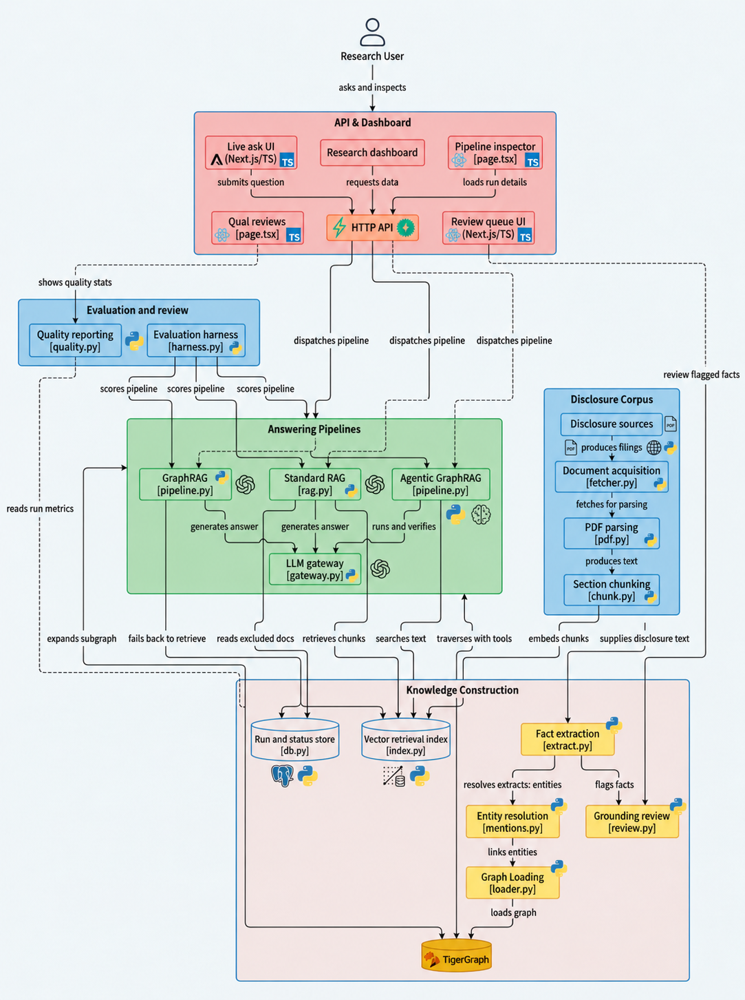
</div>

> End-to-end: raw PDFs → LLM extraction → TigerGraph knowledge graph → three answer pipelines (RAG / GraphRAG / Agentic) → evaluation dashboard.

---

### Landing page

**Hero & problem statement** — why plain RAG fails on Indian corporate governance data, and what Interlock solves.

<div align="center">
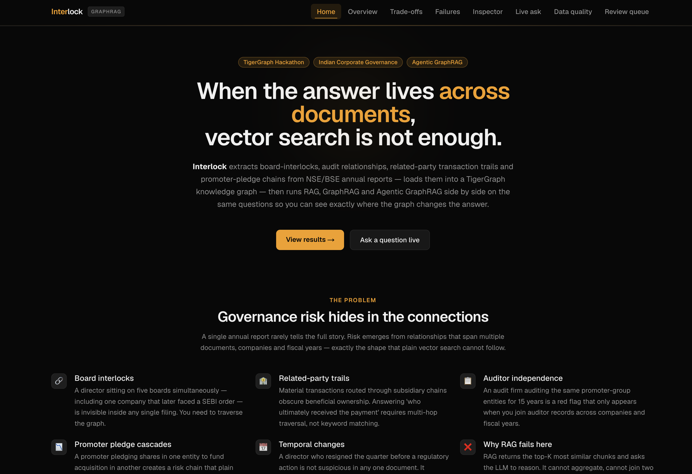
</div>

---

**Graph visual & three pipelines** — how the knowledge graph is structured, and a side-by-side explanation of the three retrieval strategies.

<div align="center">
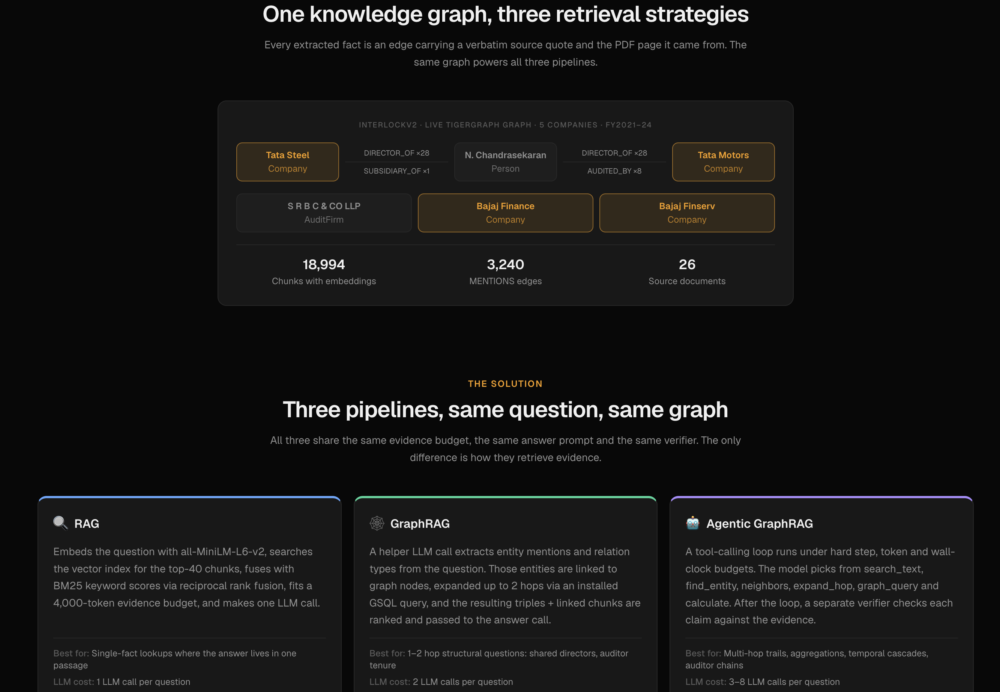
</div>

---

**Numbers & architecture columns** — live graph stats (nodes, edges, documents) and the three-phase architecture (Build / Answer / Evaluate).

<div align="center">
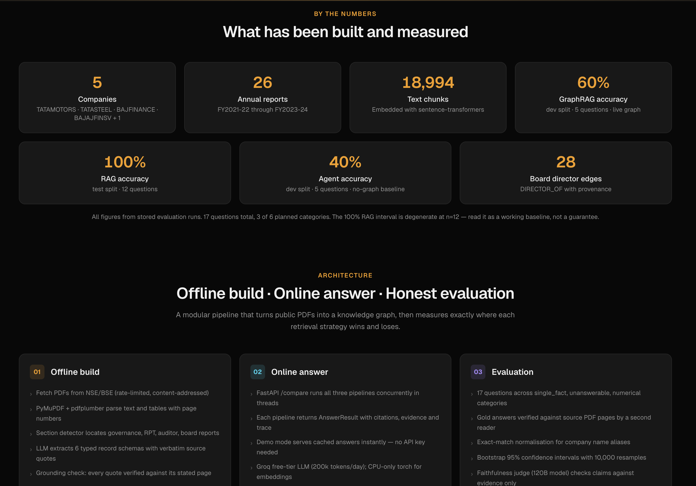
</div>

---

### Dashboard pages

**Overview** — accuracy by question category with 95 % bootstrap confidence intervals; pipeline leaders and paired differences.

<div align="center">
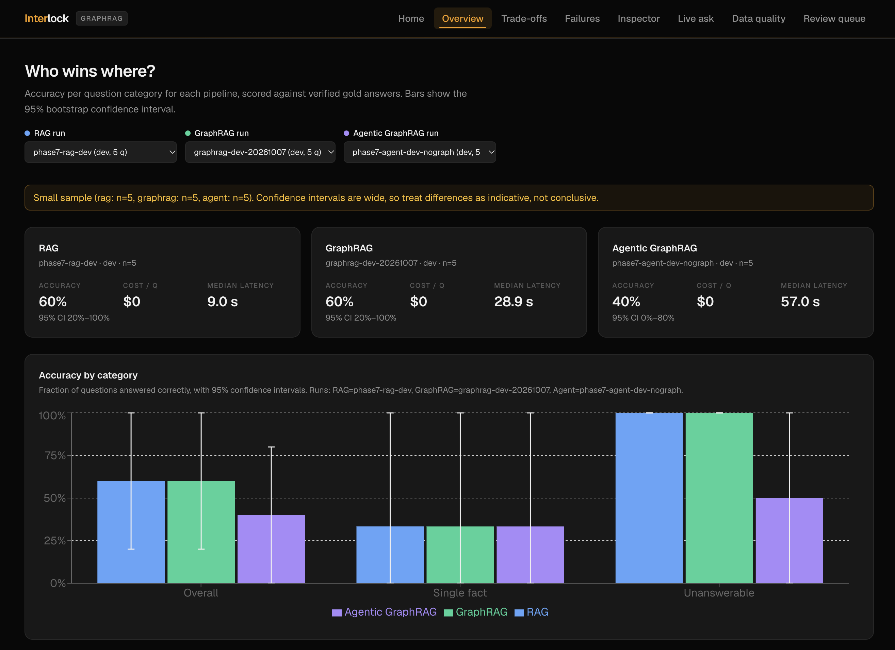
</div>

---

**Trade-offs** — cost vs accuracy vs latency scatter; LLM call and tool-call breakdown per pipeline.

<div align="center">
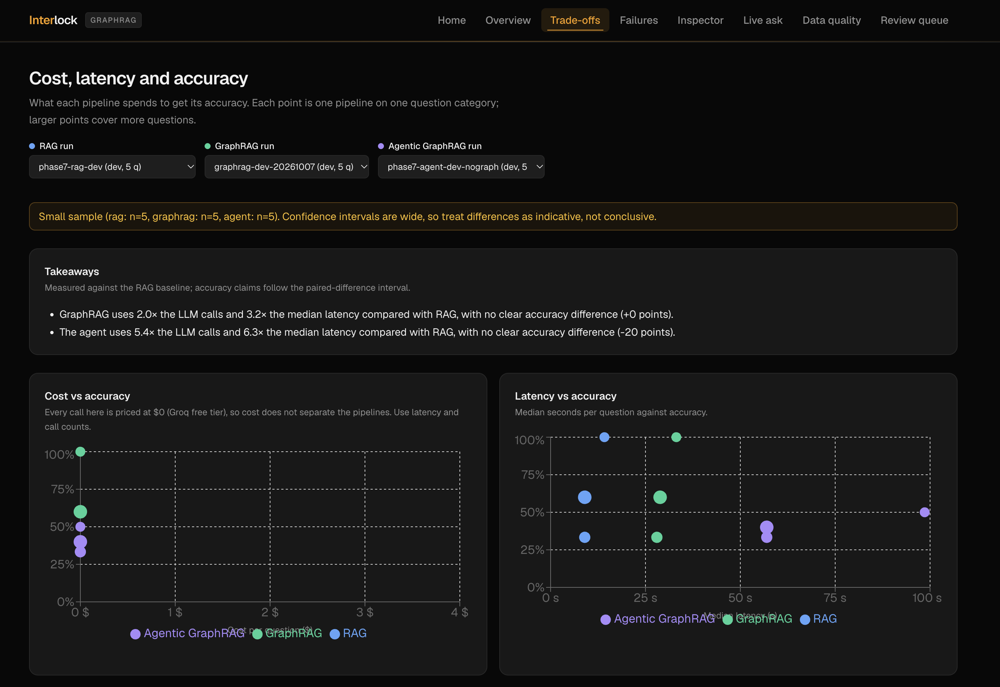
</div>

---

**Failures** — stacked failure-type bar chart by category; filterable table linked directly to the inspector.

<div align="center">
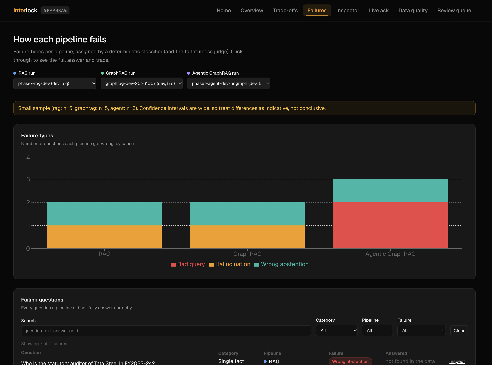
</div>

---

**Inspector** — one question, all three pipeline answers side by side; every citation links back to its source PDF page; interactive subgraph canvas and step-by-step agent traces.

<div align="center">
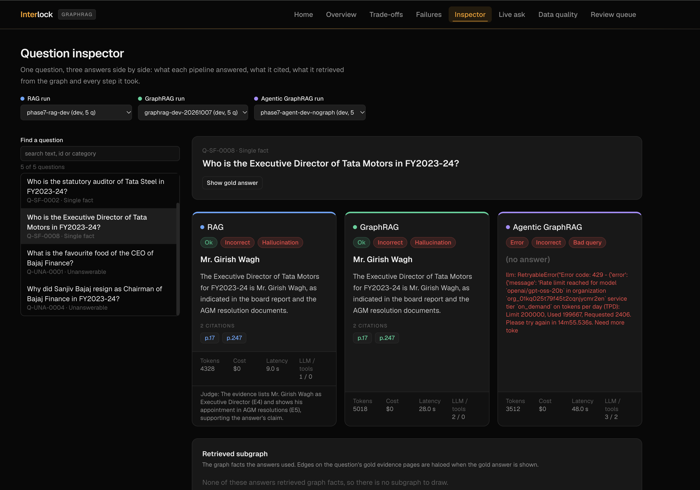
</div>

---

**Data quality** — extraction precision, entity-resolution coverage, and provenance completeness metrics.

<div align="center">
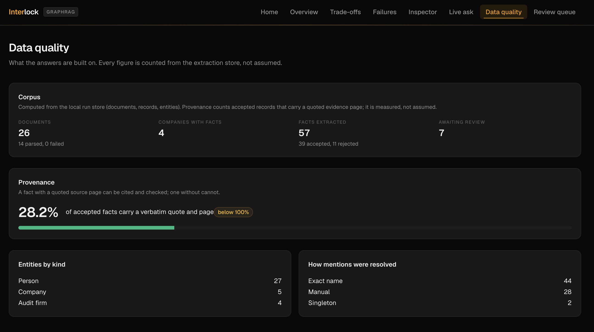
</div>

---

**Review queue** — records quarantined for low grounding confidence or entity-resolution conflicts, pending human review.

<div align="center">
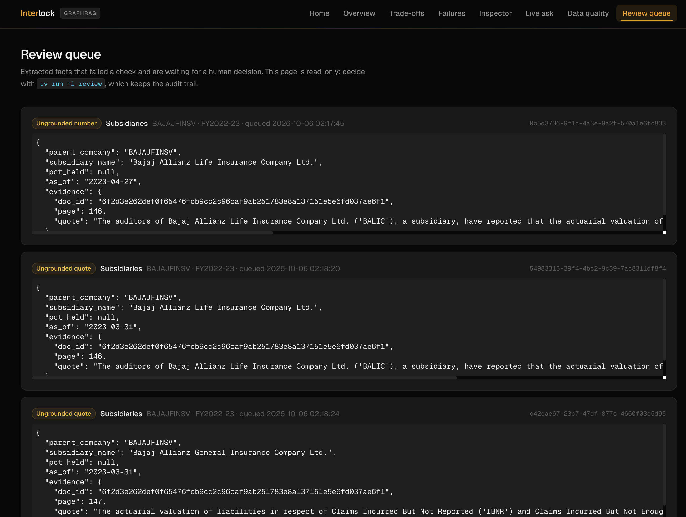
</div>

---

## Data

<div align="center">

</div>

### Corpus

| | |
|---|---|
| Source | BSE/NSE annual reports and corporate governance disclosures |
| Companies | 5 — TATASTEEL, TATAMOTORS, BAJFINANCE, BAJAJFINSV, TRF |
| Documents | 26 |
| Fiscal years | FY2021-22 → FY2023-24 |
| Chunks | 18,994 (500-token target, 60-token overlap, section-tagged) |

### Data quality

- **Grounding** — every extracted quote verified against its stated page; unverifiable facts quarantined
- **Entity resolution** — fuzzy matching (RapidFuzz ≥ 85) + FTS5 full-text search; ambiguous matches flagged for review
- **Provenance completeness** — 28.2% of accepted records carry a traceable quote and page number (measured, not assumed)

### Rebuilding from source

```bash
# Requires GROQ_API_KEY, ~$2–5 in LLM spend, several hours
uv run hl fetch           # discover + download filings
uv run hl ingest-inbox    # register PDFs from data/inbox/
uv run hl extract         # LLM extraction (disk-cached)
uv run hl build-graph     # resolve → load → embed
```

---

## Development

### Prerequisites

- Python 3.11+ with [uv](https://docs.astral.sh/uv/)
- Node.js 22+ with npm
- Docker

### Setup

```bash
git clone https://github.com/Tetra4ge/Interlock-TG.git
cd Interlock-TG
cp .env.example .env    # fill in credentials
uv sync
cd dashboard && npm ci
```

### Running tests

```bash
uv run pytest -q                      # 791 unit tests, no credentials
uv run pytest -m integration -q       # needs live TigerGraph + LLM key
cd dashboard && npm test              # 55 Vitest tests
cd dashboard && node e2e/smoke.mjs    # Playwright end-to-end
```

### Evaluation

```bash
uv run hl eval --pipeline rag --split test --run-id my-rag-run
uv run hl compare --a my-rag-run --b my-graphrag-run
```

### Repository layout

```
server/
├── api/          FastAPI routes, schemas, deps
├── pipelines/    rag/, graphrag/, agent/ — all implement Pipeline protocol
├── graph/        TigerGraph client, GSQL queries, schema
├── store/        Turso DB, FTS5 entity search
├── eval/         Scorer, judge, bootstrap stats, reporter
├── llm/          Gateway (cache · spend cap · retry), providers
└── cli.py        Entry-point: uv run hl <command>
dashboard/
├── src/app/      Next.js App Router pages (8 routes)
├── src/lib/      Pure TS: format, chart, graph layout, API client
└── src/components/
data/
├── eval/         Question set + run artefacts (results, scores, summaries)
└── samples/      Demo cache + sample graph export
tests/            unit/, integration/
docs/             Architecture, decisions, results, test-plan
```

---

## Limitations

- **Small question set.** 17 questions, 3 of 6 categories. Multi-hop, temporal and global — where GraphRAG and the Agent are designed to win — have no questions yet.
- **No head-to-head on the same test split.** GraphRAG and Agent have only dev-split runs; no comparison against RAG on the same held-out questions.
- **Free-tier LLM.** Groq's 200k tokens/day limit was exhausted during evaluation. Latency and cost figures are indicative.
- **Data coverage gaps.** `AUDITED_BY` edges exist only for BAJFINANCE and BAJAJFINSV. Tata Steel and Tata Motors auditor questions are answered by vector search, not the graph.
- **Extraction accuracy.** LLM extraction at scale produces hallucinations. The grounding step quarantines unverifiable facts; the review queue holds borderline cases. Do not treat the graph as ground truth without reviewing provenance.

---

## Disclaimer

> This is a research prototype built for the TigerGraph Hackathon. Answers are generated automatically from public filings and may contain errors. Nothing here constitutes investment, legal or financial advice. All data is sourced from public regulatory disclosures.

---

## Built by Hotty\_Fi5e

<table align="center">
  <tr>
    <td align="center" width="20%">
      <a href="https://github.com/Rahul-8283"></a><br>
      <b>Rahul L S</b><br>
      <a href="https://github.com/Rahul-8283">@Rahul-8283</a>
    </td>
    <td align="center" width="20%">
      <a href="https://github.com/prajwal-priyadarshan"></a><br>
      <b>G Prajwal Priyadarshan</b><br>
      <a href="https://github.com/prajwal-priyadarshan">@prajwal-priyadarshan</a>
    </td>
    <td align="center" width="20%">
      <a href="https://github.com/KKabilan07"></a><br>
      <b>Kabilan K</b><br>
      <a href="https://github.com/KKabilan07">@KKabilan07</a>
    </td>
    <td align="center" width="20%">
      <a href="https://github.com/KishoreB25"></a><br>
      <b>Kishore B</b><br>
      <a href="https://github.com/KishoreB25">@KishoreB25</a>
    </td>
    <td align="center" width="20%">
      <a href="https://github.com/kesavvvvvv"></a><br>
      <b>Kesav</b><br>
      <a href="https://github.com/kesavvvvvv">@kesavvvvvv</a>
    </td>
  </tr>
</table>

---

<div align="center">
  <sub>Built with TigerGraph · FastAPI · Next.js · sentence-transformers · Groq</sub>
</div>
