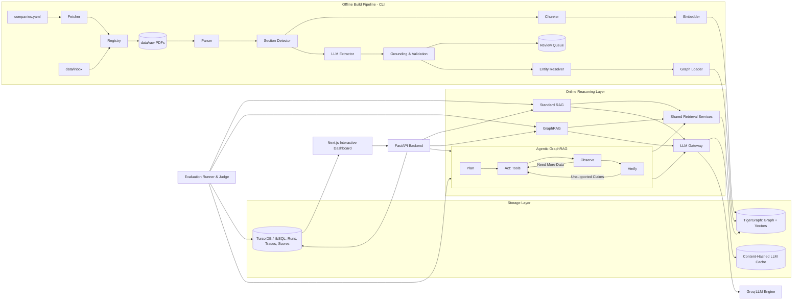

<div align="center">

# 🕸️ Interlock
### Agentic GraphRAG for Corporate Governance & Disclosure Networks

[](https://python.org)
[](https://www.tigergraph.com/)
[](https://groq.com/)
[](https://nextjs.org/)
[](https://www.typescriptlang.org/)
[](https://fastapi.tiangolo.com/)
[](https://turso.tech/)
[](https://tailwindcss.com/)
[](https://docker.com)

<p align="center">
  <b>Uncovering hidden governance risks, multi-hop board entanglements, and promoter pledge trails in Indian listed disclosures.</b>
</p>

</div>

---

## 📌 Overview

**Interlock** answers complex natural-language queries about Indian listed companies (NSE/BSE) by parsing and reasoning across public regulatory disclosures—including Annual Reports, Shareholding Pattern filings, Related-Party Transaction (RPT) disclosures, and SEBI regulatory orders.

It constructs a **typed, temporal knowledge graph** spanning companies, directors, key managerial personnel (KMP), substantial shareholders, auditors, transactions, and regulatory actions. 

Interlock rigorously compares **three distinct AI retrieval architectures** against the exact same corpus, budget, and validation rules:

| Pipeline | Retrieval & Reasoning Mechanism | Target Query Complexity |
| :--- | :--- | :--- |
| **Standard RAG** | Vector similarity search over chunked text disclosures + single-turn LLM generation. | Single-fact lookups, general semantic search. |
| **GraphRAG** | Named entity resolution, bounded GSQL subgraph expansion + linked context injection + single-turn LLM generation. | 1-hop & 2-hop structural relationships. |
| **Agentic GraphRAG** | Autonomous agent equipped with graph traversal tools, AST calculators, text search, and a claim-level verification loop. | Multi-hop trails, aggregations, temporal cascades, and forensic checks. |

---

## 💡 Why Interlock?

Corporate governance risk rarely sits isolated inside a single paragraph or filing. It emerges from **interconnected relationships across disclosures**:
- A common independent director sitting across multiple boards where one entity faced SEBI sanctions.
- Promoter share pledge spikes distributed across obscure holding companies and subsidiaries.
- Material related-party transactions routed through entities sharing common beneficial ownership.
- Sudden auditor resignations preceding adverse regulatory scrutiny.

> **The Problem with Plain RAG:** Traditional chunk-and-retrieve vector RAG fails to join facts across disparate documents, cannot reliably trace multi-hop paths, and frequently hallucinates numerical aggregations. **Interlock quantifies and solves this gap.**

---

## ⚡ Powered by TigerGraph

Interlock leverages **TigerGraph** as its primary graph computation and vector storage engine:
- **GSQL Schema & Graph Modelling:** Native graph schema modelling complex governance relationships with strict time attributes.
- **High-Performance GSQL Queries:** Parameterized, installed GSQL queries for multi-hop expansion, common director discovery, shortest path detection, and accumulator-based numerical aggregations.
- **Hybrid Vector + Graph Retrieval:** Graph topology combined with TigerGraph vector embeddings for comprehensive contextual grounding.
- **Python Integration:** Seamless communication using `pyTigerGraph`.

---

## 🚀 Key Architectural Principles

- **Strict Evidence Grounding:** Every extracted graph edge is immutably linked to its source document, page number, and verbatim quote. Records failing quote verification are quarantined.
- **Controlled Benchmark Comparison:** All three pipelines share the same underlying LLM (via Groq), retrieval services, and output schemas (`AnswerResult`) to ensure objective evaluation.
- **Safe Agent Execution:** Read-only graph query permissions, deterministic AST-based math calculators, step/token safety caps, and claim-level verification against primary documents.
- **Deterministic & Reproducible:** Content-hashed LLM caching, frozen dev/test evaluation splits, run configurations, and one-command graph rebuilds.

---

## 🏗️ System Architecture



---

## 🛠️ Tech Stack

| Domain | Technologies |
| :--- | :--- |
| **Graph & Database** | **TigerGraph** (GSQL, pyTigerGraph), **Turso / libSQL** (FTS5 search, run storage) |
| **Inference & LLMs** | **Groq API** (Llama-3-70B / 8B), Custom Cache & Spend Cap Gateway |
| **Backend & CLI** | **Python 3.11+**, `uv`, **FastAPI**, **Pydantic v2**, `httpx`, `pytest` |
| **Document Processing** | **PyMuPDF**, **pdfplumber**, Custom Layout Section Detectors |
| **Frontend Dashboard** | **Next.js 14** (App Router), **React**, **TypeScript**, **Tailwind CSS**, **Lucide Icons** |
| **DevOps & Infrastructure** | **Docker Compose**, GitHub Actions |

---

## 🏁 Getting Started

### 1. Prerequisites
- **Python 3.11+** with [uv](https://docs.astral.sh/uv/) installed.
- **Node.js 18+** and `npm`.
- A running **TigerGraph** instance (Local Docker or TigerGraph Cloud Savanna).
- A free **Groq API Key**.

---

### 2. Environment Configuration

Create a `.env` file in the project root:

```env
# ==========================================
# TigerGraph Credentials (Docker or Savanna)
# ==========================================
TG_HOST=http://localhost
TG_USERNAME=tigergraph
TG_PASSWORD=tigergraph
TG_SECRET=
TG_GRAPH=SpikeGraph
TG_RESTPP_PORT=9000
TG_GS_PORT=14240

# ==========================================
# Database (Turso / libSQL)
# ==========================================
TURSO_DATABASE_URL=file:db/interlock.db
TURSO_AUTH_TOKEN=

# ==========================================
# LLM Provider API Key (Groq)
# ==========================================
GROQ_API_KEY=your_groq_api_key_here

# ==========================================
# Application Settings & Safety Caps
# ==========================================
DEMO_MODE=false
LLM_OFFLINE=false
LLM_SPEND_CAP_USD=25

# ==========================================
# Frontend Dashboard
# ==========================================
NEXT_PUBLIC_API_URL=http://localhost:8000
```

---

### 3. Running the Services

The application is structured into an **Offline Data & Ingestion Pipeline** and an **Online Interactive Dashboard**.

#### 🔹 Terminal 1: Python Ingestion & Processing Pipeline (CLI)
We utilize `uv` with our custom `hl` (Hackathon LLM) command suite:

```bash
# Sync dependencies and create the virtual environment
uv sync

# Run database migrations (Turso / libSQL)
uv run hl db-migrate

# Acquire filings & disclosures (Phase 1)
uv run hl fetch

# Parse PDFs into structured text and tables (Phase 2)
uv run hl parse

# Detect and segment governance sections (Phase 2)
uv run hl detect-sections

# Break sections into token-limited overlapping chunks (Phase 2)
uv run hl chunk

# Extract typed JSON records using LLMs (Phase 2)
uv run hl extract --run-id "test-run-1"

# Interactive manual review queue CLI (Phase 2)
uv run hl review

# Inspect acquired dataset coverage & filing inventory
uv run hl coverage

# (Optional) Test LLM Gateway connectivity
uv run hl llm-ping "Hello, are you working?"
```

#### 🔹 Terminal 2: Interactive Next.js Frontend
Launch the modern visualization dashboard:

```bash
cd dashboard
npm install
npm run dev
```
Open [http://localhost:3000](http://localhost:3000) in your browser to explore the dashboard.

---

## 📚 Documentation Deep Dives

- 📑 **[PRD (Product Requirements Document)](docs/PRD.md):** User personas, functional requirements, and success metrics.
- 📐 **[TRD (Technical Requirements Document)](docs/TRD.md):** GSQL graph schemas, libSQL tables, and data models.
- 🏛️ **[Architecture Guide](docs/ARCHITECTURE.md):** In-depth pipeline flows, tool execution sandbox, and ADRs.
- 📋 **[Build Phases](docs/phases/):** Step-by-step modular implementation plan (Phases 0–10).
