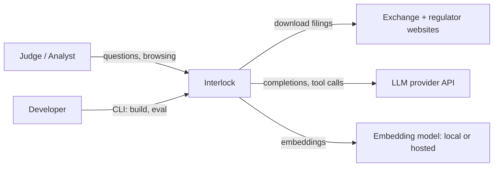
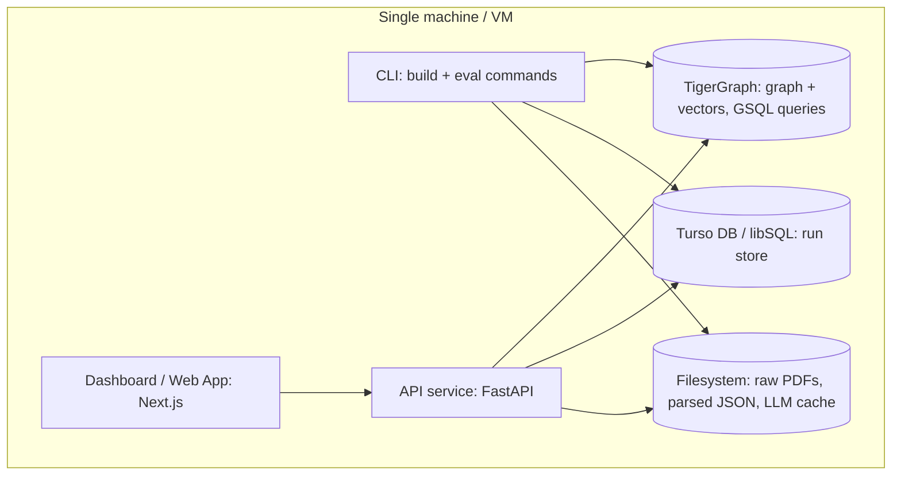
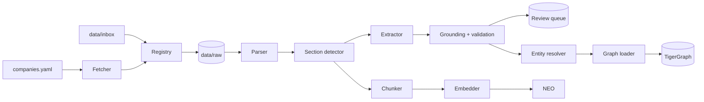
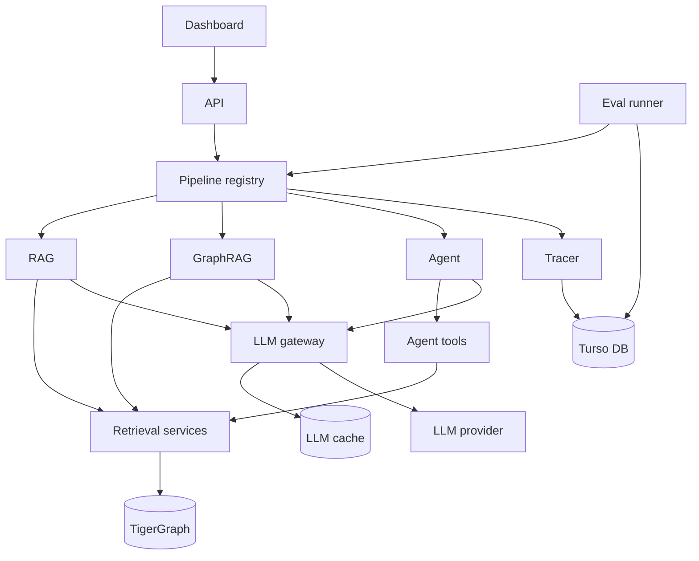
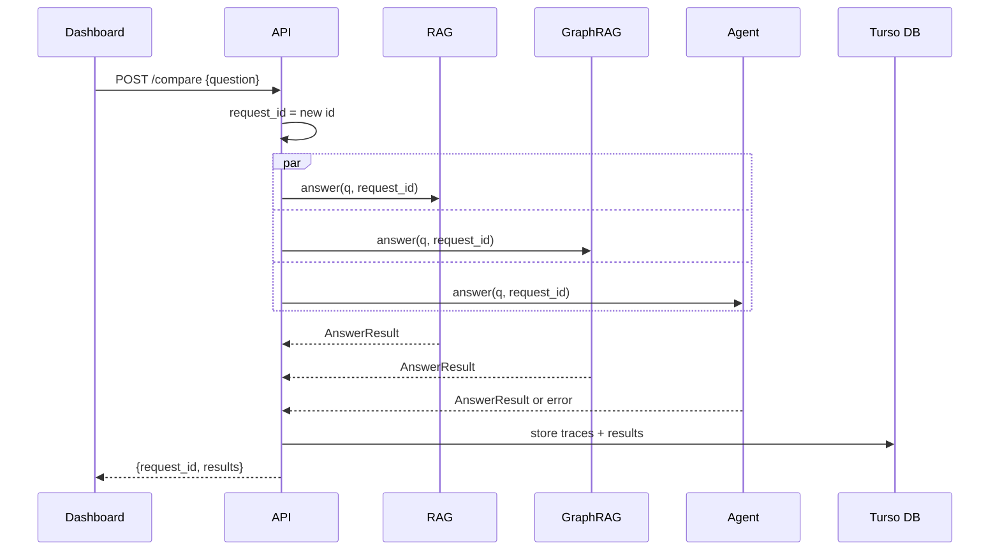
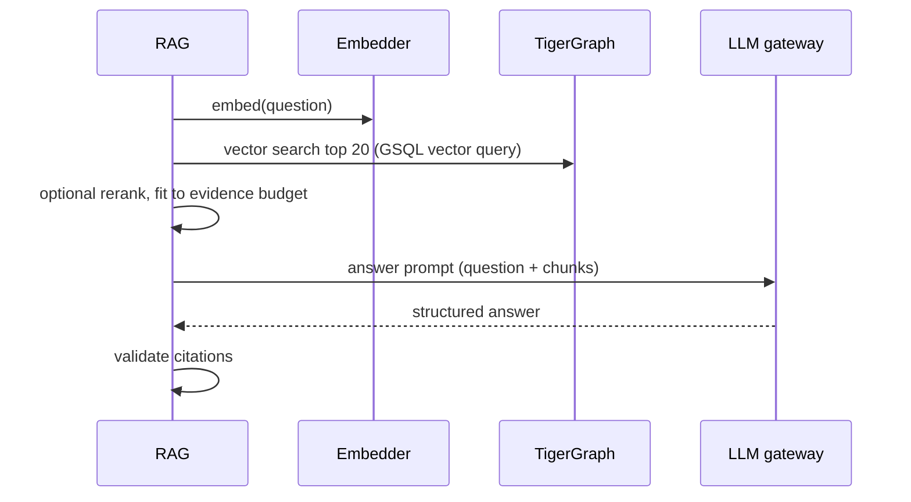
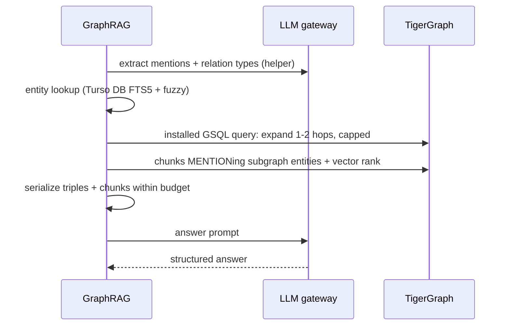
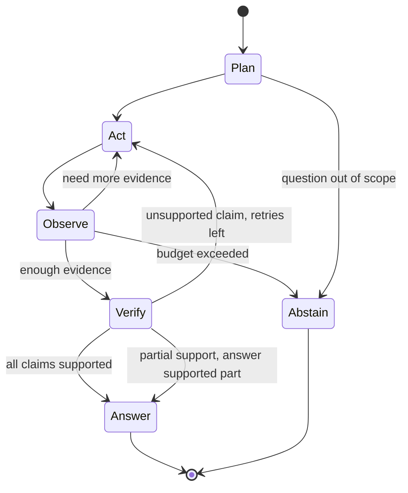
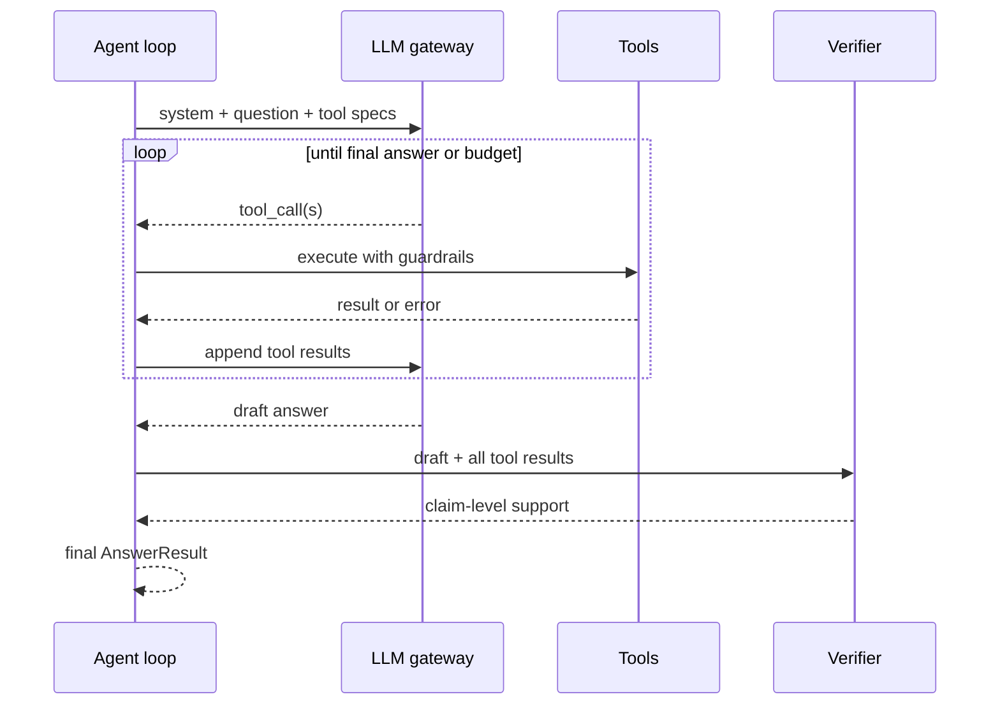
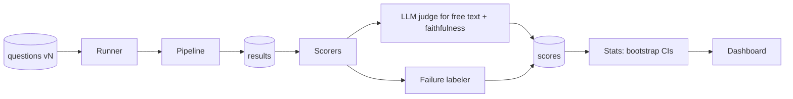

# ARCHITECTURE — Interlock

| Field | Value |
| --- | --- |
| Document | System Architecture |
| Version | 1.0 |
| Related | `PRD.md`, `TRD.md`, `phases/` |

---

## 1. Architecture at a glance

Interlock is a **modular monolith** with two halves joined by shared storage:

- **Offline build pipeline** — turns public PDFs into a verified knowledge graph and a vector index. Runs as CLI commands.
- **Online answer + evaluation layer** — three question-answering pipelines, an evaluation runner, an API and a dashboard.

**Why a modular monolith.** One developer or a small team, one machine, no independent scaling needs. Separate modules give clean boundaries and testability. Microservices would add network calls, deployment work and failure modes with no benefit here.

---

## 2. System context



| External system | Direction | Purpose | Failure impact |
| --- | --- | --- | --- |
| Exchange / regulator websites | Outbound, build time only | Source documents | Build blocked → manual inbox fallback |
| LLM provider | Outbound | Extraction, answering, judging | Build/eval blocked → cache covers reruns; demo uses cached answers |
| Embedding model | Local or outbound | Chunk and query vectors | Local model avoids the dependency |

---

## 3. Containers (runtime units)



| Container | Technology | Runs as | Responsibilities |
| --- | --- | --- | --- |
| CLI | Python (`interlock.cli`) | On-demand commands | Fetch, parse, extract, resolve, load, embed, eval |
| API | FastAPI + Uvicorn | Long-running (Compose service) | Serve pipelines, runs, metrics, subgraphs |
| Dashboard | Next.js (React, Tailwind CSS, TypeScript) | Long-running (Compose service) | Five pages for judges |
| TigerGraph | TigerGraph (Community/Developer edition in Docker, or Savanna cloud) | Long-running (Compose service or hosted) | Entities, relations, chunks, embeddings; installed GSQL queries for traversal, aggregation and vector search |
| Turso DB | libSQL (cloud or local file) | Embedded / Cloud Service | Documents, records, questions, runs, scores, traces, entity-name FTS5 index |
| Filesystem | Local disk | — | Raw PDFs, intermediate JSON, LLM cache |

---

## 4. Offline build pipeline

### 4.1 Flow



### 4.2 Stage contracts

| Stage | Input | Output | Idempotency key | Rerun cost |
| --- | --- | --- | --- | --- |
| Fetcher | companies.yaml | files via Registry | URL + hash | Near zero (skips known hashes) |
| Registry | file | `documents` row, `data/raw/<sha>.pdf` | sha256 | Zero |
| Parser | raw PDF | `data/parsed/<doc_id>.json` (pages, tables) | doc_id + parser version | Seconds per doc |
| Section detector | parsed JSON | `sections` rows | doc_id | Negligible |
| Chunker | parsed JSON + sections | `data/parsed/<doc_id>.chunks.json` | doc_id + chunk config | Negligible |
| Extractor | sections | `records` rows (candidate) | doc_id + section + prompt version | Zero if cached |
| Grounding + validation | records | status accepted/rejected/review | record_id | Negligible |
| Resolver | accepted records | `entities`, `merge_log` | mention_id | Seconds |
| Loader | entities + records | TigerGraph vertices/edges (upsert) | entity_id / edge_id (upsert by primary id + discriminator) | Seconds–minutes |
| Embedder | chunks | `Chunk.embedding` | chunk_id + model | Zero if cached |

### 4.3 Data lineage

Every fact in the graph can be traced back:

```
Graph edge (edge_id)
  → run_id (extraction_runs: model, prompt version, git commit)
  → record_id (records: payload, status)
  → doc_id + page + quote
  → documents row (source_url, fetched_at)
  → data/raw/<doc_id>.pdf
```

---

## 5. Online layer

### 5.1 Components



**Retrieval services** are shared functions used by all pipelines and tools: `vector_search`, `entity_search` (Turso DB FTS5 + fuzzy), `expand_subgraph`, `chunks_for_entities`, `get_evidence`. Sharing them guarantees the pipelines differ only in *how* they use retrieval, not in retrieval quality.

### 5.2 Request sequence: `/compare`



### 5.3 RAG sequence



### 5.4 GraphRAG sequence



### 5.5 Agent control loop





### 5.6 Evaluation flow



---

## 6. Deployment view

```mermaid
flowchart TB
    subgraph Compose[docker compose]
        tigergraph[tigergraph service: ports 14240 (GraphStudio/Admin), 9000 (REST++); volume tg_data — or Savanna cloud instance]
        api[api service: port 8000; mounts data/, db/]
        dash[dashboard service: port 3000]
    end
    dash --> api
    api --> tigergraph
```

| Mode | How | Data |
| --- | --- | --- |
| Development | TigerGraph in Compose (or Savanna); code runs from the host with uv | Full data |
| Demo (judges) | All three services in Compose | Committed sample graph + cached answers; works without LLM key for stored questions |
| Hosted (optional) | Same Compose file on one VM; basic auth in front | Sample or full graph |

---

## 7. Cross-cutting concerns

| Concern | Approach |
| --- | --- |
| Configuration | YAML + `.env` → one typed `Settings` object |
| Identity of things | Content hashes for documents; official IDs (DIN/CIN/FRN) for entities; deterministic ids for chunks and edges |
| Idempotency | Every stage keyed; upserts in graph (primary id + edge discriminator); skip-if-done in CLI |
| Provenance | doc_id + page + quote on every fact edge; run_id on every record and edge |
| Caching | LLM responses by content hash on disk; embeddings by chunk_id + model |
| Fairness | Shared prompts, shared retrieval services, one evidence budget, one answer model |
| Security | Read-only agent graph access (allow-listed installed GSQL queries, read-only role), AST calculator, untrusted-text wrapping, secrets in env |
| Observability | JSON logs, `traces`, `llm_calls`, run metadata, `/health` |
| Error handling | Explicit statuses; review queue; retries with backoff in gateway and fetcher |
| Reproducibility | Versioned questions and prompts; run config + git commit stored; cached calls |

---

## 8. Architecture decision records (summary)

Write one short file per decision in `docs/decisions/`.

| ADR | Decision | Status |
| --- | --- | --- |
| 0001 | PDF parser choice (decided in Phase 0 bake-off) | Pending |
| 0002 | Modular monolith, not microservices | Accepted |
| 0003 | TigerGraph (required by the hackathon) holds the graph and, if supported, vectors; GSQL installed queries for traversal; entity-name search in Turso DB FTS5 | Accepted |
| 0004 | Turso DB (libSQL) for production cloud & local run store | Accepted |
| 0005 | Own LLM gateway with content-hash cache | Accepted |
| 0006 | Hand-written agent state machine (LangGraph if needs grow) | Accepted |
| 0007 | Custom GraphRAG over typed schema | Accepted |
| 0008 | Time modeled as edge properties; related-party transactions as nodes | Accepted |
| 0009 | Embedding model chosen by recall@10 on own questions | Pending (Phase 3) |
| 0010 | Next.js dashboard (React, Tailwind CSS); FastAPI required | Accepted |
| 0011 | TigerGraph deployment (Savanna vs Docker), version, native vector support or local fallback, GSQL spike results | Pending (Phase 0) |

ADR template:

```markdown
# ADR-000N: <title>
Date: <date>
Status: Proposed | Accepted | Superseded by ADR-XXXX
## Context
<the problem and forces>
## Decision
<what we chose>
## Alternatives considered
<options and why rejected>
## Consequences
<trade-offs, what becomes easier/harder>
```

---

## 9. Diagram for the submission

For the required architecture diagram, combine sections 4.1, 5.1 and 5.5 into one image:

- Left: offline build pipeline.
- Middle: TigerGraph + Turso DB.
- Right: three pipelines side by side, with the agent's loop shown as an inset.
- Bottom: evaluation runner → dashboard.

Render Mermaid to PNG/SVG with the Mermaid CLI or an online Mermaid editor, then clean it up in a drawing tool if needed. **Verify** the Mermaid CLI's current install command.
